# Backend Controller: AI Szolgáltatások

Ez a réteg felelős a kliensoldali kérések fogadásáért, a validációért, a külső AI szolgáltatások (Python ML scriptek, Google Gemini API) orkesztrációjáért és az eredmények perzisztens tárolásáért.

## 1. Architektúrális Szerep

A controller a **Közvetítő (Mediator)** szerepét tölti be a rendszerben. Nem végez nehéz számításokat, hanem koordinálja az adatfolyamot a különböző alrendszerek között:

1. **Input:** HTTP kérések fogadása a Frontendtől (JSON vagy Multipart/Form-data).
2. **Process:**
* Képek ideiglenes tárolása és kezelése.
* Python alrendszer hívása (Bőrelemzés).
* Gemini API hívása (Chat és Színtípus).

3. **Output:** Strukturált JSON válasz küldése és adatbázis szinkronizáció.

## 2. Bőrelemzés Vezérlése (`analyzeSkin`)

Ez a függvény valósítja meg a legkomplexebb logikát, mivel bináris fájlkezelést és külső folyamathívást igényel.

### 2.1. Működési Folyamat

A `analyzeSkin` metódus egy állapotmentes (stateless), tranzakcionális folyamatot valósít meg, kiemelt figyelemmel az erőforrás-kezelésre.

1. **Kérés Validáció:**
* Ellenőrzi a feltöltött fájl meglétét (`req.file`).
* Ellenőrzi a felhasználó jogosultságát (`req.user`).

2. **Fájl Menedzsment:**
* A memóriában érkező fájlt (`buffer`) kiírja az operációs rendszer ideiglenes könyvtárába (`os.tmpdir()`).
* **Biztonság:** Egyedi fájlnevet generál (`timestamp + random`) az ütközések elkerülése végett.

3. **Szolgáltatás Hívás:**
* Meghívja a `skinAnalysisService`-t, amely elindítja a korábban dokumentált Python scriptet.
* **Takarítás (Cleanup):** A hívás után – függetlenül a kimenet sikerességétől – azonnal törli az ideiglenes fájlt (`fs.unlink`), megelőzve a szerver tárhelyének telítődését.

4. **Adatbázis Szinkronizáció (Upsert):**
* Megkeresi a felhasználó legutóbbi elemzését.
* Ha létezik, frissíti (`UPDATE`), ha nem, újat hoz létre (`INSERT`). Ez biztosítja az adatbázis konzisztenciáját.

### 2.2. Adataggregáció

A controller nem csupán továbbítja az AI kimenetét, hanem dúsítja (enrichment) azt. Párhuzamosan (`Promise.all`) lekéri:

* Az AI diagnózist.
* A bőrtípushoz tartozó kezelési protokollt.
* A detektált problémákhoz tartozó specifikus tanácsokat.

Így a kliens egyetlen hívással megkap minden szükséges információt a megjelenítéshez.

## 3. Generatív AI Funkciók (`chatWithAI`, `analyzeColorType`)

Ezek a függvények a Google Gemini API-ra épülő szolgáltatásokat kezelik.

### 3.1. Intelligens Chat (`chatWithAI`)

* **Context Awareness:** A kérésben fogadja a beszélgetési előzményeket (`conversationHistory`), így az AI "emlékszik" a kontextusra.
* **Hibatűrés:** Ha a Gemini API nem elérhető, a controller strukturált hibaüzenettel tér vissza, megakadályozva a backend összeomlását.

### 3.2. Színtípus Elemzés (`analyzeColorType`)

Ez a funkció a chat alapú interakció eredményét fordítja le adatbázis rekorddá.

* **Logika:** A Gemini által meghatározott évszaktípust (pl. "Autumn") megkeresi a `color_seasons` referenciatáblában.
* **Felhasználói Profil:** Siker esetén frissíti a `users` táblában a felhasználó `color_season_id`-ját, így a profiloldalon azonnal megjelenik az eredmény.

## 4. Kép Alapú Chat (`chatWithImage`)

Ez a funkció lehetővé teszi a "multimodális" interakciót (szöveg + kép).

* **Adatátvitel:** A képet Base64 kódolású stringként fogadja a JSON body-ban, ami egyszerűsíti a kliens-oldali implementációt (nem kell Multipart form).
* **Kontextus Injektálás:** A controller lekéri a felhasználó korábban meghatározott színtípusát az adatbázisból, és ezt "rejtett kontextusként" átadja az AI-nak. Így ha a felhasználó feltölt egy ruhát és megkérdezi "Jól állna ez nekem?", az AI a felhasználó színtípusa alapján tud válaszolni.

## 5. Hibakezelési Stratégia

A modul egységes hibakezelési patternt követ:

* **Input Validáció:** "Fail-fast" elv – azonnal visszatér 400-as hibával, ha hiányzik a paraméter.
* **Service Isolation:** A külső szolgáltatások (AI, DB) hibáit elkapja (`try-catch`), logolja a konzolra a hibakereséshez, és szabványosított hibaobjektumot küld a kliensnek (`serverError` helper).
* **Resource Safety:** A `finally` ágak (vagy azzal ekvivalens logikai elhelyezés) garantálják az erőforrások (pl. temp fájlok) felszabadítását hiba esetén is.