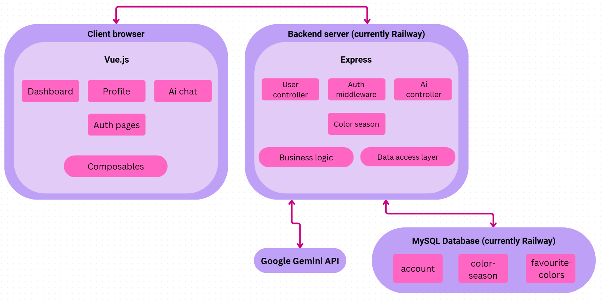
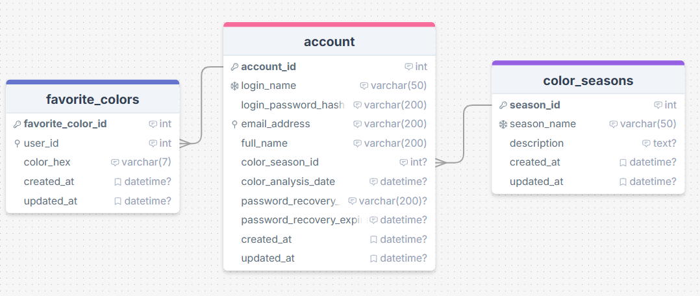
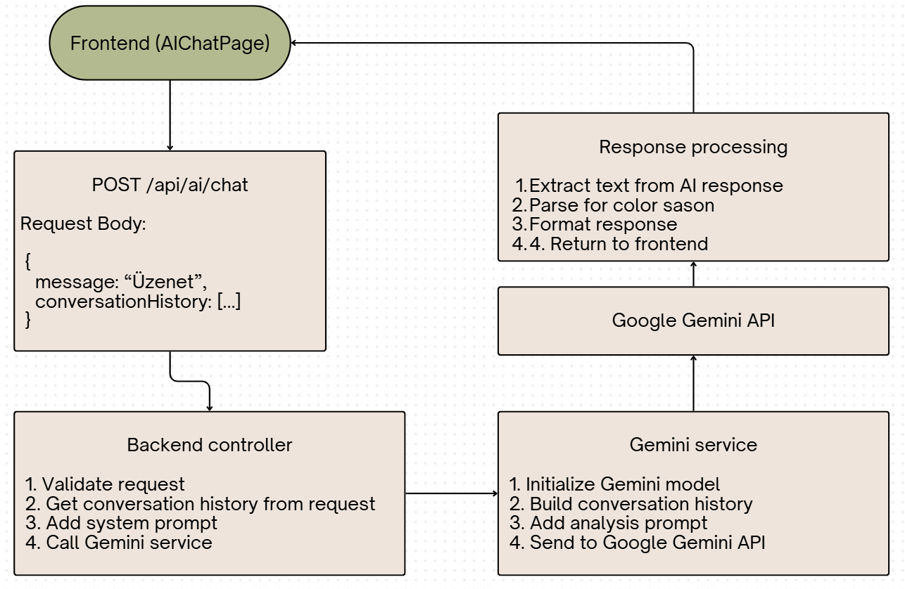
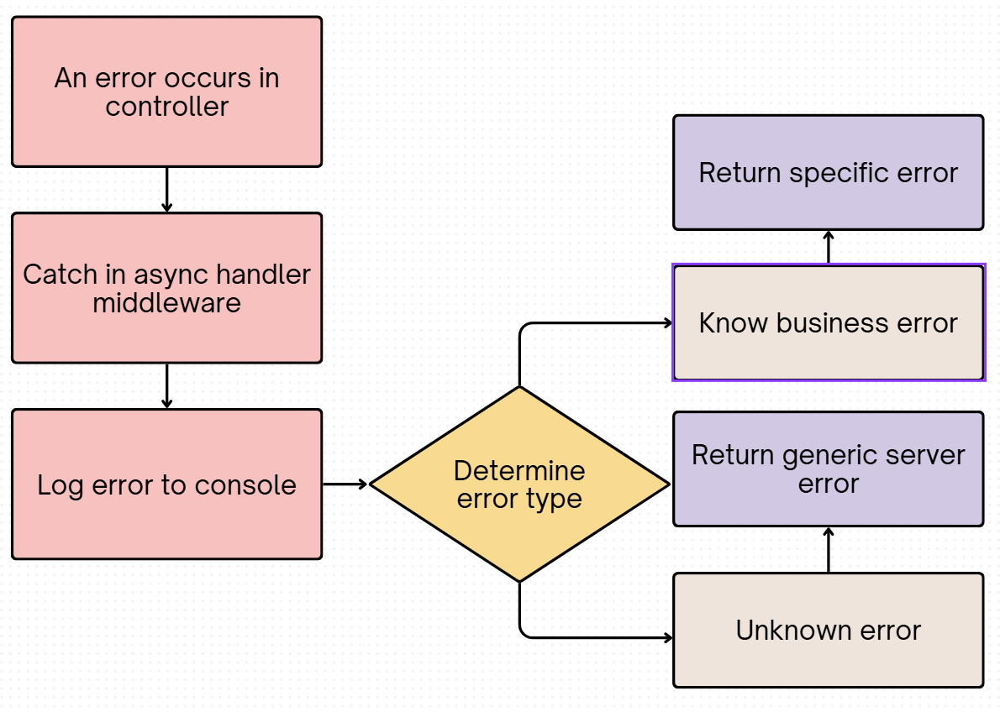

# Developer Specification - Season Analysis Application

## Table of Contents
1. [System Overview](#system-overview)
2. [System Architecture](#system-architecture)
3. [Database Design](#database-design)
4. [API Documentation](#api-documentation)
5. [Authentication and Security](#authentication-and-security)
6. [AI Integration](#ai-integration)
7. [Security Considerations](#security-considerations)
8. [Error Handling](#error-handling)
9. [Glossary](#glossary)

---

## System Overview

The Season Analysis Application is a full-stack web application that provides AI-powered color season analysis for users. The system consists of three main components:

- **Frontend**: Vue.js 3 Single Page Application (SPA)
- **Backend**: Node.js REST API with Express
- **Database**: MySQL relational database
- **AI Service**: Google Gemini API integration

### Technology Stack

**Frontend**:
─ Vue 3 
─ Vue Router 
─ Vite 
─ SCSS 

**Backend**:
─ Node.js
─ Express 
─ Sequelize (ORM)
─ bcrypt (Password hashing)
─ jsonwebtoken (Authentication)
─ Nodemailer (Email service)

**Database**:
─ MySQL 

**External Services**:
─ Google Gemini API (AI chat)
─ Railway (Backend hosting + MySQL)
─ Vercel (Frontend hosting)

---

## System Architecture

The application follows a three-tier architecture pattern:

### Frontend Layer (Vue.js 3 + Vite)
- Single Page Application hosted on Vercel
- Vue Router for navigation with authentication guards and guest mode support
- Composable-based state management (useAuth)
- Axios for API communication with JWT token authentication
- Guest mode: allows unauthenticated users to access AI chat functionality

### Backend Layer (Node.js + Express)
- RESTful API hosted on Railway
- JWT-based authentication middleware
- Layered architecture: Router → Middleware -> Controller -> Service -> Data Access
- Sequelize ORM for database operations

### Database Layer (MySQL on Railway)
- Relational database with three main tables
- Foreign key relationships for data integrity
- Indexed columns for query performance

### External Services
- Google Gemini API for AI-powered color analysis
- SMTP (local only) for password recovery emails

---

## Database Design

### Entity Relationship Diagram

### Database Schema Details

**account Table**
- Stores user account information
- Password is hashed using bcrypt (cost factor 10)
- Password recovery uses token-based system with expiration
- Foreign key to color_seasons table for assigned season
- Timestamps track account creation and modifications

**color_seasons Table**
- Reference table for the four color seasons
- Pre-populated with: spring, summer, autumn, winter
- Contains season descriptions and characteristics
- Immutable reference data

**favorite_colors Table**
- One-to-many relationship with account table
- Stores user's favorite colors as hex codes
- Each color is validated to match #RRGGBB format
- Users can save unlimited favorite colors

---

## Database Design

**account**
- User credentials and profile information
- Password hashed with bcrypt (cost factor 10)
- Token-based password recovery with 24h expiration
- Foreign key links to assigned color season

**color_seasons**
- Reference table: spring, summer, autumn, winter
- Pre-populated, read-only data

**favorite_colors**
- User's saved color palette
- Hex format validation (#RRGGBB)
- Unlimited colors per user

---

## API Documentation

### Endpoints

**Authentication**
- `POST /api/user/login` - Login with username/password, returns JWT token
- `POST /api/user/register` - Create new account
- `POST /api/auth/forgot-password` - Request password reset email
- `POST /api/auth/reset-password` - Reset password with token

**User Management** (Protected)
- `GET /api/user/profile` - Get user profile data
- `PUT /api/user/password` - Change password
- `DELETE /api/user/account` - Delete account permanently
- `PUT /api/user/color-season` - Update assigned color season
- `POST /api/user/favorite-color` - Add favorite color
- `DELETE /api/user/favorite-color` - Remove favorite color
- `GET /api/user/favorite-colors` - Get all favorite colors

**AI Chat**
- `POST /api/ai/chat` - Send message to AI, receive analysis (Protected)
- `POST /api/ai/chat-guest` - Guest mode AI chat (No authentication required)

**Note:** Guest mode allows visitors to interact with the AI without registration. Guest sessions don't save analysis results to user profiles and conversation history is not persisted on the server.

Common error codes: `INVALID_CREDENTIALS`, `USERNAME_TAKEN`, `EMAIL_TAKEN`, `INVALID_TOKEN`, `TOKEN_EXPIRED`, `MISSING_REQUIRED_FIELDS`

---

## Authentication and Security

### Password Security
- bcrypt hashing with cost factor 10
- Stored as 200-character hash

### JWT Tokens
- HS256 algorithm
- 24-hour expiration
- Payload includes: user ID, username, email
- Required in Authorization header: `Bearer <token>`

### Password Recovery
- Secure random token generation
- Token hashed before database storage
- 24-hour expiration
- One-time use only
- Email delivery (local only, SMTP blocked on Railway)

### Input Validation
- Frontend: Required fields, format validation
- Backend: Type checking, format validation
- Database: NOT NULL constraints, UNIQUE constraints, foreign keys

---

## AI Integration

### Google Gemini API
- Model: gemini-1.5-flash
- Conversation-based analysis
- System prompts guide AI behavior
- History maintained in frontend (not persisted)

### Flow
1. User sends message via `/api/ai/chat`
2. Backend adds system prompt (first message only)
3. Conversation history sent to Gemini API
4. AI responds with color analysis or questions
5. Frontend displays response
6. When analysis requested, special prompt triggers season determination
7. AI responds with season (spring/summer/autumn/winter)
8. Frontend parses response and offers to save season to profile

### Prompts
- **System Prompt**: Guides AI to act as color analysis expert, ask questions about appearance
- **Analysis Prompt**: Instructs AI to determine season based on conversation and provide explanation

---

### Limitations
- Railway blocks outbound SMTP (no email in production)
- Solution: Use email API (SendGrid, Resend) or run backend locally for password recovery

---

## AI Integration

### Google Gemini API Integration Architecture

---

## Security Considerations

The application implements multiple layers of security to protect user data and prevent common web vulnerabilities.

### 1. SQL Injection Prevention

The application uses Sequelize ORM to prevent SQL injection attacks. Sequelize automatically uses parameterized queries, ensuring user input is never directly concatenated into SQL statements. All queries are sanitized before execution, making it impossible for attackers to inject malicious SQL code into database queries.

### 2. Password Hashing

Passwords are hashed using bcrypt with a cost factor of 10, which means each password goes through 2^10 (1024) iterations of the hashing algorithm. This makes password cracking computationally expensive and protects against password theft in case of database breaches, rainbow table attacks, and brute force attacks. Passwords are irreversibly transformed and stored as 200-character hashes that cannot be reversed to obtain the original password.

### 3. Automatic Password Salting

Each password receives a unique random salt that is automatically generated by bcrypt. The salt is embedded in the hash string, ensuring that identical passwords for different users produce completely different hashes. This protects against rainbow table attacks and makes it impossible to detect password patterns across users, even if the database is compromised.

### 4. JWT Token Authentication

The application uses JSON Web Tokens (JWT) with HS256 algorithm for stateless authentication. Tokens are cryptographically signed with a secret key and contain user data plus an expiration timestamp. Each protected route request is verified for valid signature and expiration. This protects against session hijacking, CSRF attacks, and unauthorized API access without requiring server-side session storage.

### 5. Secure Password Recovery

Password recovery uses a two-step security process. First, a 32-byte random token is generated using Node's crypto library, which provides cryptographically secure randomness. The token is then hashed with bcrypt before being stored in the database. Only the plain token is sent to the user's email for one-time use. Tokens automatically expire after 24 hours and are permanently deleted after successful password reset. This protects against token guessing attacks, token reuse, and unlimited validity exploits.

### 6. CORS Protection

Cross-Origin Resource Sharing (CORS) is configured to only allow requests from whitelisted origins. In production, only the Vercel frontend URL is permitted; in development, localhost is allowed. The browser automatically blocks any requests from unauthorized domains, protecting against unauthorized cross-origin requests and preventing malicious websites from stealing user data.

### 7. Multi-Layer Input Validation

The application implements three layers of input validation. The Vue.js frontend validates required fields, email format, and password length before sending requests. Backend controllers verify data types, string lengths, and format patterns such as email addresses and hex color codes. Finally, the MySQL database schema enforces NOT NULL constraints, UNIQUE constraints, and foreign key relationships. This multi-layer approach protects against invalid data insertion, XSS attacks, and format-based exploits.

### 8. JWT Token Expiration

All JWT tokens automatically expire after 24 hours. The authentication middleware verifies token expiration on every protected route request. When a token expires, the frontend automatically logs out the user and requires re-authentication. This protects against token replay attacks and limits the damage from stolen tokens, as they become useless after 24 hours.

### 9. Database Referential Integrity

MySQL foreign key constraints enforce referential integrity throughout the database. The relationship between account and color_seasons uses ON DELETE SET NULL, which preserves the user account even if their assigned season is removed. The relationship between account and favorite_colors uses ON DELETE CASCADE, which automatically removes all favorite colors when a user account is deleted. These constraints prevent orphaned records and maintain data consistency.

---

## Error Handling

### Error Codes

Authentication Errors:
- INVALID_CREDENTIALS
- TOKEN_EXPIRED
- UNAUTHORIZED
- INVALID_TOKEN

Validation Errors:
- MISSING_REQUIRED_FIELDS
- INVALID_EMAIL_FORMAT
- INVALID_HEX_COLOR
- PASSWORD_TOO_SHORT
- USERNAME_TOO_SHORT

Business Logic Errors:
- USERNAME_TAKEN
- EMAIL_TAKEN
- USER_NOT_FOUND
- SEASON_NOT_FOUND
- COLOR_ALREADY_EXISTS

System Errors:
- DATABASE_ERROR
- EMAIL_FAILED
- SERVER_ERROR

### Error Handling Flow

---

## Glossary

### General Terms

**SPA (Single Page Application)** - Web application that loads a single HTML page and dynamically updates content without full page reloads.

**ORM (Object-Relational Mapping)** - Technology that maps database tables to programming language objects, allowing database operations without writing SQL.

**JWT (JSON Web Token)** - Compact, URL-safe token format for securely transmitting information between parties as a JSON object.

**CORS (Cross-Origin Resource Sharing)** - Security mechanism that allows web pages to make requests to a different domain than the one serving the page.

**bcrypt** - Password hashing algorithm designed to be computationally expensive to prevent brute-force attacks.

**Salt** - Random data added to passwords before hashing to ensure identical passwords produce different hashes.

**Cost Factor** - Number of iterations in bcrypt hashing algorithm (cost 10 = 2^10 = 1024 iterations).

**Middleware** - Software layer that processes requests between the client and the final route handler.

**REST API** - Web service architecture using HTTP methods (GET, POST, PUT, DELETE) to perform operations on resources.

**Foreign Key** - Database column that references the primary key of another table, enforcing relationships between tables.

**Parameterized Query** - SQL query where user input is passed as parameters instead of being concatenated into the query string, preventing SQL injection.

### Color Season Analysis Terms

**Why Color Season Analysis?**

Color season analysis helps individuals identify which color palettes enhance their natural features, making them look more vibrant, healthy, and harmonious. By understanding their season, users can make informed decisions about clothing, makeup, and accessories, creating a cohesive personal style that maximizes their natural beauty. This eliminates guesswork in shopping, reduces wardrobe mistakes, and builds confidence in personal appearance.

**Color Season** - Classification system that categorizes individuals into four seasonal types (Spring, Summer, Autumn, Winter) based on their natural coloring.

**Spring Season** - Warm, bright, and clear color palette. Characteristics: golden undertones, light and warm colors, high contrast. Best colors: peach, coral, golden yellow, turquoise.

**Summer Season** - Cool, soft, and muted color palette. Characteristics: blue undertones, soft and cool colors, low contrast. Best colors: lavender, dusty rose, soft blue, cool gray.

**Autumn Season** - Warm, deep, and muted color palette. Characteristics: golden undertones, rich and earthy colors, medium contrast. Best colors: rust, olive green, warm brown, burnt orange.

**Winter Season** - Cool, bright, and clear color palette. Characteristics: blue undertones, bold and icy colors, high contrast. Best colors: pure white, black, emerald green, royal blue.

**Undertone** - The subtle hue beneath the skin's surface, either warm (golden/yellow) or cool (blue/pink). Determines the fundamental temperature of colors that suit a person.

**Color Temperature** - Classification of colors as warm (containing yellow) or cool (containing blue). Warm seasons are Spring and Autumn; cool seasons are Summer and Winter.

**Color Intensity** - How bright or muted a color appears. Spring and Winter have bright, clear colors; Summer and Autumn have soft, muted colors.

**Contrast** - The difference between a person's hair, skin, and eye colors. High contrast suits Spring and Winter; low contrast suits Summer and Autumn.

**Hex Color Code** - Six-digit hexadecimal representation of a color in format #RRGGBB, where RR (red), GG (green), and BB (blue) range from 00 to FF. Used to store users' favorite colors precisely in the database.

**Color Palette** - Collection of colors that harmonize with a person's natural coloring based on their assigned season.

**Capsule Wardrobe** - Minimalist wardrobe consisting of essential, versatile pieces in a cohesive color palette that can be mixed and matched.

---

