# Komponens Specifikáció: useAuth (Központi Autentikációs Modul)

A `useAuth.js` egy Vue 3 Composable, amely az alkalmazás **Identitáskezelési (Identity Management)** és **Munkamenet-vezérlési (Session Control)** logikáját centralizálja. Ez a fájl nem csupán egy függvénygyűjtemény, hanem egy **de facto Store (Állapottároló)**, amely biztosítja, hogy a felhasználó bejelentkezési állapota konzisztens maradjon az egész alkalmazásban.

## 1. Architektúra: Osztott Állapotkezelés (Shared State Pattern)

A modul legfontosabb tervezési döntése, hogy a reaktív állapotváltozókat (`token`, `user`) a `useAuth` függvény hatókörén **kívül** definiálja.

Ez a **Singleton (Egyke)** mintához hasonló viselkedést eredményez: bár a `useAuth()` függvényt több komponensben is meghívhatjuk (pl. Header, Login oldal, Router), mindegyik példány **ugyanazt a memóriaterületet** és ugyanazokat az adatokat fogja látni és módosítani.

### Adatperzisztencia

A rendszer automatikus szinkronizációt végez a böngésző `localStorage` adatbázisával. Ez biztosítja a **perzisztenciát**: ha a felhasználó frissíti az oldalt, a memória kiürül, de a `useAuth` inicializáláskor visszatölti az adatokat a helyi tárolóból, így a felhasználó nem léptetődik ki.



## 2. A Bejelentkezési Folyamat (Login Flow)

A `login` metódus a rendszer belépési pontja. Ez a függvény nemcsak a backend kommunikációt végzi, hanem a teljes állapotfrissítési láncot is vezérli.

**A folyamat lépései:**

1. **API Hívás:** A `userService.login` metódussal elküldi a hitelesítő adatokat.
2. **Validáció:** Ellenőrzi, hogy a válasz tartalmaz-e tokent.
3. **State Update:** Frissíti a reaktív változókat (`token.value`, `user.value`).
4. **Storage Update:** Írja a `localStorage`-ot.
5. **Visszajelzés:** Visszaad egy státusz objektumot `{ success: true/false }`, amit a UI (LoginView) felhasznál a navigációhoz vagy hibaüzenethez.



## 3. Biztonsági Réteg: Token Validáció és Lejárat

A `validateToken` függvény a kliensoldali biztonság kulcsa. Mivel a JWT (JSON Web Token) egy Base64 kódolt string, a frontend képes dekódolni annak tartalmát anélkül, hogy a backendhez fordulna.

**Működési mechanizmus:**

1. **Split & Decode:** A token három részből áll (`Header.Payload.Signature`). A kód a középső részt (`Payload`) veszi, és a natív `atob()` függvénnyel dekódolja.
2. **Expiration Check:** A payload `exp` mezője tartalmazza a lejárati időt (Unix timestamp formátumban).
3. **Auto-Logout:** Ha `jelenlegi_idő > lejárati_idő`, a rendszer érvénytelennek tekinti a tokent, és azonnal meghívja a `logout()` függvényt, védve a rendszert az illetéktelen hozzáféréstől.

**Ez a függvény fut le:**

* Az alkalmazás indulásakor (`initAuth`).
* Kritikus műveletek előtt (opcionálisan).

## 4. Aszinkron Állapotkezelés (Wrapper Pattern)

A `withLoading` egy ún. **Utility Wrapper** (Segédcsomagoló), amely drasztikusan csökkenti a kódismétlést a komponensekben.

**Probléma:** Minden API hívásnál külön kellene kezelni a:

* `loading = true`
* `try { await api() }`
* `catch { error = ... }`
* `finally { loading = false }`
lépéseket.

**Megoldás:** A `withLoading` ezt egyetlen hívásba sűríti:

```javascript
// Használat a komponensben:
await withLoading(async () => {
    // Csak az üzleti logika
    await userService.doSomething();
});

```

Ez tisztább, olvashatóbb kódot eredményez a nézetekben (Views).

## 5. Integrációs Pontok: Hol használjuk a kódot?

Mivel ez a modul "Global Shared State"-ként viselkedik, az alkalmazás szinte minden rétegében jelen van.

### 5.1. Navigációs Őrök (Vue Router Guard)

**Hely:** `src/router/index.js`
**Feladat:** Útvonalvédelem.
Mielőtt a felhasználó belépne egy védett oldalra (pl. `/dashboard`), a router ellenőrzi a `useAuth().isAuthenticated` értékét. Ha hamis, visszadobja a loginra.

### 5.2. Fejléc és Layout (TheHeader.vue)

**Hely:** `src/components/layout/TheHeader.vue`
**Feladat:** Felhasználói visszajelzés.

* Megjeleníti a bejelentkezett felhasználó nevét (`user.name`).
* Itt található a "Kijelentkezés" gomb, amely a `logout()` függvényt hívja.
* Állapottól függően váltogat a "Login/Register" és a "Profil" gombok között.

### 5.3. Bejelentkezési és Regisztrációs Űrlapok

**Hely:** `src/views/auth/LoginView.vue`, `RegisterView.vue`
**Feladat:** Interakció.

* Közvetlenül hívják a `login()` és `register()` függvényeket.
* Használják a `errorMessage` és `loading` változókat a visszajelzéshez.

### 5.4. Alkalmazás Indítása (App.vue)

**Hely:** `src/App.vue`
**Feladat:** Bootstrapping.
Az alkalmazás "felébredésekor" (`onMounted`) meghívja az `initAuth()`-ot. Ez ellenőrzi, hogy maradt-e érvényes token a `localStorage`-ban az előző munkamenetből. Ha igen, beállítja az állapotot; ha lejárt, törli azt.

## 6. Segédfüggvények és Validáció

A modul tartalmaz kisebb, de fontos segédeszközöket is:

* **`refreshUser`:** Opcionálisan lekéri a friss felhasználói adatokat a szerverről (hasznos, ha pl. a felhasználó megváltoztatta a profilképét vagy nevét egy másik eszközön).
* **`validateForm`:** Egy könnyűsúlyú validátor, amely ellenőrzi, hogy a kötelező mezők ki vannak-e töltve. Ez megakadályozza a felesleges API hívásokat üres űrlapok esetén.
* **`checkQueryMessages`:** Képes a URL paraméterekből (pl. `?registered=true`) üzeneteket kiolvasni és megjeleníteni a felhasználónak (pl. "Sikeres regisztráció, most lépj be!").