# useFormValidation (Adatvalidációs Logikai Réteg)

A `useFormValidation.js` egy újrafelhasználható, funkcionális logikai egység (Utility Composable), amely az alkalmazás **bemeneti adatellenőrzési rétegét** valósítja meg. A modul célja az adatintegritás biztosítása a kliensoldalon, még mielőtt a kérések a szerver felé továbbításra kerülnének.

A komponens **állapotmentes (Stateless)** architektúrát követ: nem tárolja az űrlapok állapotát, kizárólag a bemeneti értékek (Input Values) és a definiált szabályrendszer (Validation Schema) alapján determinisztikus kimenetet generál.

## 1. Működési Elv és Algoritmus

A validációs logika a **"Fail-Fast" (Gyors Hiba)** stratégiát implementálja. Ez az algoritmus optimalizálja az erőforrás-használatot azáltal, hogy a validációs láncot az első hiba észlelésekor megszakítja az adott mezőnél.

### A Kötegelt Feldolgozó Motor (Batch Processing Engine)

A `validateForm` függvény a modul központi végrehajtó egysége.

**Az algoritmus lépései:**

1. **Iteráció:** A függvény végighalad a validációs sémában (`rules` objektum) definiált mezőkön.
2. **Szekvenciális Kiértékelés:** Minden mezőhöz tartozhat egy szabálylista (Array). A motor sorban hajtja végre a szabályokat.
3. **Rövidzár Logika (Short-Circuit Evaluation):** Amennyiben egy szabály hibát jelez (visszatérési értéke nem `null`), a motor azonnal rögzíti a hibát, és **megszakítja** a további szabályok vizsgálatát az adott mezőre vonatkozóan. Ez biztosítja, hogy a felhasználó mindig a legrelevánsabb (legelső) hibát lássa (pl. először a "Kötelező", és ne a "Formátum hibás" üzenetet kapja üres mezőnél).



## 2. Validációs Szabálykészlet (Validator Library)

A modul egy `validators` objektumot exportál, amely előre definiált, tiszta függvényeket (Pure Functions) tartalmaz a leggyakoribb adatellenőrzési feladatokra.

### Implementált Szabályok:

1. **`required` (Kötelezőség):**
* Ellenőrzi, hogy az érték nem `null`, nem `undefined` és nem üres string.


2. **`email` (Formátum):**
* RFC-kompatibilis reguláris kifejezést (`regex`) használ az email cím szintaktikai helyességének ellenőrzésére.
* *Regex Minta:* `/^[^\s@]+@[^\s@]+\.[^\s@]+$/`


3. **`minLength` / `maxLength` (Terjedelem):**
* Numerikus összehasonlítást végez a bemeneti string hosszán (`value.length`).


4. **`match` (Egyezőség):**
* Két bemeneti érték szigorú egyezőségét (`===`) vizsgálja. Elsődleges felhasználása a jelszó-megerősítő mezők ellenőrzése.


5. **`username` (Szintaxis):**
* Alfanumerikus karakterekre és alulvonásra korlátozza a bemenetet, valamint hosszúsági korlátokat (3-20 karakter) kényszerít ki.


## 3. Jelszó Komplexitás Logika (Security Policy)

A `password` validátor egy többlépcsős ellenőrzési kapurendszert (Gatekeeper System) valósít meg a biztonságos jelszavak kikényszerítésére. Minden feltételnek teljesülnie kell a validáció sikerességéhez.

**Az ellenőrzési lánc:**

1. **Hossz:** Minimum 8 karakter.
2. **Nagybetű:** Legalább egy `[A-Z]` karakter.
3. **Kisbetű:** Legalább egy `[a-z]` karakter.
4. **Számjegy:** Legalább egy `[0-9]` karakter.


## 4. Polimorfizmus a Validációban

A `validateForm` függvény támogatja a **Polimorfikus Hívásokat**, ami nagyfokú rugalmasságot biztosít a fejlesztés során. A szabályrendszer (`rules`) definiálásakor kétféle típusú validátort fogad el:

1. **String Referencia:** A beépített könyvtárra hivatkozó kulcs (pl. `'required'`).
2. **Inline Callback Függvény:** Egyedi, helyben definiált logikai függvény, amely lehetővé teszi speciális, komponens-szintű szabályok létrehozását.

```javascript
// Technikai megvalósítás a kódban
const error = typeof rule === 'function'
  ? rule(form[field])                // Egyedi függvény direkt hívása
  : validators[rule]?.(form[field])  // Beépített validátor hívása

```

## 5. Integrációs Pontok és Felhasználás

A modul az alkalmazás összes űrlap-alapú nézetében integrálásra került, biztosítva az egységes validációs élményt.

### 5.1. Regisztrációs Nézet (`RegisterView.vue`)

Ez a komponens használja a legbővebb szabálykészletet.

* **Validált mezők:** Felhasználónév (`username`), Email (`email`), Jelszó (`password`), Jelszó megerősítés (`match`).

### 5.2. Bejelentkezési Nézet (`LoginView.vue`)

* **Validált mezők:** Csak az alapvető kitöltöttséget (`required`) ellenőrzi, a formátumellenőrzést a backendre bízza biztonsági okokból (User Enumeration elkerülése).

### 5.3. Jelszó Visszaállítás (`ResetPasswordView.vue`)

* **Validált mezők:** A `password` komplexitási szabályokat és a `match` egyezőségi szabályt alkalmazza az új jelszó beállításakor.

## 6. API Kimeneti Specifikáció

A `validateForm` metódus visszatérési értéke egy szabványosított állapotobjektum:

| Tulajdonság   | Típus     | Leírás                                                                                                                                       |
| ------------- | --------- | -------------------------------------------------------------------------------------------------------------------------------------------- |
| **`isValid`** | `Boolean` | Logikai érték. `true`, ha az űrlap minden mezője sikeresen átment az összes validációs lépésen.                                              |
| **`errors`**  | `Object`  | Asszociatív tömb (Map). Kulcsai a mezőnevek, értékei a validátorok által generált lokalizált hibaüzenetek. Csak a hibás mezőket tartalmazza. |