# DashboardPage.vue

## 1. Áttekintés

A **DashboardPage** az alkalmazás főoldala, amely a bejelentkezett felhasználók számára jeleníti meg a rendelkezésre álló funkciókat (modulokat). Fullscreen scroll alapú, modern UI-val mutatja be az AI Színszakértő és Bőrelemzés modulokat.

* **Típus:** Page Component (Nézet)
* **Útvonal:** `/dashboard`
* **Védelem:** Auth Guard által védett (csak érvényes JWT tokennel érhető el).

---

## 2. Felépítés és Architektúra

### 2.1 Felhasznált Tervezési Minták

1. **Separation of Concerns (SoC):**
* **Logika:** Kiszervezve Composables-be (`useAuth`) és Services-be.
* **Adat:** Leválasztva egy külső konfigurációs fájlba (`dashboard-content.js`).
* **Stílus:** SCSS mixinekbe szervezve a globális konzisztencia érdekében.


2. **DRY (Don't Repeat Yourself):** A redundáns HTML kód elkerülése érdekében a kártyák renderelése adatvezérelt (data-driven) módon, ciklusokkal történik.
3. **MVVM (Model-View-ViewModel):** A Vue reaktív rendszere biztosítja az adat (Model) és a felület (View) automatikus szinkronizációját.

### 2.2 UI Komponensek

| Komponens            | Forrás                      | Funkció                          |
| -------------------- | --------------------------- | -------------------------------- |
| `AnimatedBackground` | `@/layouts`                 | Animált háttér a hero szekcióhoz |
| `ThemeSwitcher`      | `@/components/common/theme` | Sötét/világos mód váltó          |

### 2.3 Struktúra

A HTML struktúra szemantikus elemekre épül (`header`, `nav`, `aside`, `section`).

* **Fix Fejléc (`<header>`):** A legfelső réteg. Tartalmazza a navigációs vezérlőket, a bejelentkezett felhasználó nevét megjelenítő komponenst, valamint a `ThemeSwitcher` komponenst.
* **Oldalsáv (`<aside>`):** A diagram bal oldalán látható egység alapértelmezetten rejtett állapotban van. Ez a réteg tartalmazza a teljes navigációs menüt, a felhasználói profilt és a kijelentkezés gombot. Megjelenését a `sidebarOpen` reaktív változó vezérli.
* **Görgethető Tartalom (`.scroll-container`):** A tényleges oldal tartalmát hordozza (Hero szekció, Modul szekciók).

---

## 3. Üzleti Logika és Állapotkezelés (`<script setup>`)

A kód nem tartalmaz direkt API hívásokat vagy komplex autentikációs logikát, ezeket absztrakciós rétegeken keresztül éri el.

### 3.1 Függőségek és Navigáció

```javascript
const router = useRouter()       // Navigációs vezérlő
const { user, logout } = useAuth() // Autentikációs szolgáltatás

```

* **`useAuth`**: Ez a saját fejlesztésű *Composable* felel a felhasználói munkamenet kezeléséért. Reaktív `user` objektumot biztosít, amely automatikusan frissül, ha a háttérben változik az állapot.

**Navigációs Útvonalak:**

| Honnan    | Hová             | Trigger                         |
| --------- | ---------------- | ------------------------------- |
| Dashboard | `/chat`          | Modul kattintás vagy header nav |
| Dashboard | `/skin-analysis` | Modul kattintás vagy header nav |
| Dashboard | `/results`       | Header nav                      |
| Dashboard | `/profile`       | Sidebar nav                     |
| Dashboard | `/login`         | Logout után                     |

### 3.2 Reaktív Állapotmodell

1. **Lokális UI-vezérlés:**
A `sidebarOpen` (`Ref<boolean>`) egy komponens-szintű reaktív változó. Értéke kizárólag a felhasználói interfész pillanatnyi állapotát (oldalsáv láthatósága) vezérli. Nem perzisztens adat; az oldal újratöltésekor alaphelyzetbe áll.
2. **Injektált Üzleti Állapot (Shared State):**
A `user` objektum nem a komponensben keletkezik, hanem a `useAuth` composable szolgáltatásból kerül ki. Ez egy globális, megosztott állapotra mutató referencia, amely biztosítja, hogy a fejléc és a profil adatok szinkronban legyenek.
3. **Statikus Tartalom:**
A megjelenített szöveges tartalmak (`hero`, `modules`) a `dashboard-content.js` fájlból importált, egyszerű JavaScript objektumok.

### 3.3 Adatvezérelt Tartalom (Data Binding)

A tartalom (szövegek, címek, leírások) nem a kódba égetve (hardcoded) szerepel, hanem strukturált adatobjektumként kerül importálásra:

```javascript
export const dashboardContent = {
  hero: { /* ... */ },
  modules: [
    {
      id: 'ai-color-expert',
      route: '/chat',
      title: 'AI Színszakértő',
      // ...
    },
    // ...
  ]
}

```

* **Előny:** Ha változik a marketing szöveg vagy bővül egy új funkcióval az app, nem kell a Vue komponenst módosítani, elég a JSON struktúrát szerkeszteni. Ez növeli a karbantarthatóságot.

### 3.4 Metódusok és Interakció

* **`openModule(route)`**: Navigációt valósít meg. A kártyákra kattintva hívódik meg, és a `router.push()` segítségével irányítja át a felhasználót újratöltés nélkül (SPA).
* **`handleLogout()`**: A kijelentkezési folyamat függvénye (wrapper), amely delegálja a feladatot a `useAuth` service-nek.
* **`toggleSidebar()`**: A `sidebarOpen` értékét módosítja, ezzel vezérelve a mobilmenüt.

> A folyamatábra bemutatja, hogyan kezeli a JavaScript logika a bemeneti eseményeket. A modulok megnyitása közvetlen navigációt indít, míg az oldalsáv vezérlése a reaktív állapotot (`sidebarOpen`) módosítja.

---

## 4. Felhasználói Felület (`<template>`)

### 4.1 Fix Fejléc

A fejléc a `position: fixed` és `z-index: 1001` tulajdonságoknak köszönhetően mindig a tartalom felett lebeg.

* **Glassmorphism effekt:** A `backdrop-filter: blur()` használatával a fejléc elhomályosítja a mögötte elhaladó tartalmat.
* **Feltételes Renderelés (`v-if`):** A felhasználónév (`user.fullName`) csak akkor kerül kiírásra, ha az adatbázisból való betöltés sikeres volt.

### 4.2 Dinamikus Tartalomrenderelés

A rendszer legfontosabb optimalizációs pontja a modulok megjelenítése. Ahelyett, hogy minden funkcióhoz külön HTML blokkot írtunk volna, egyetlen sablont használunk újra:

```html
<section v-for="(module, index) in modules" 
         :key="module.id" 
         class="fullscreen-section feature-section"
         @click="openModule(module.route)">
  </section>

```

* A Vue virtuális DOM-ja végigiterál a `modules` tömbön.
* A `:key="module.id"` biztosítja a hatékony nyomon követést.
* A sorszámozás (`01`, `02`) dinamikusan generálódik az index alapján.

### 4.3 Fullscreen Scroll Konténer

A tartalom egy `.scroll-container` div-ben helyezkedik el, amely leválasztja a görgetést a `body`-ról. Ez teszi lehetővé a **CSS Scroll Snap** technológia alkalmazását, ahol a görgetés "mágnesként" viselkedik.

---

## 5. Stílus és Design Rendszer (SCSS)

A stíluslapok a modularitás és a könnyű karbantarthatóság jegyében **SCSS** (Sassy CSS) nyelven íródtak, erős támaszkodással a mixinekre és változókra.

### 5.1 Scroll Snap Implementáció

```css
.scroll-container {
  scroll-snap-type: y mandatory; /* Kötelező (mandatory) igazítás Y tengelyen */
  height: 100vh;
  overflow-y: scroll;
}
.fullscreen-section {
  scroll-snap-align: start; /* A szekció tetejéhez igazít */
  height: 100dvh; /* Dynamic Viewport Height */
}

```

### 5.2 Reszponzivitás (Media Queries)

A rendszer **Mobile-First** megközelítést alkalmaz, de specifikus szabályokkal kezeli a különböző nézeteket a `width` (szélesség) alapján:

* **Mobil és Tablet Portrait (< 1024px):** A helytakarékosság érdekében a Sidebart elrejtjük (`left: -280px`), a felső navigáció inaktív. A tartalom lineáris (flex-col) elrendezést kap. Még a 820px széles tabletek is ezt a nézetet kapják.
* **Tablet Landscape és Laptop (1024px - 1200px):** Megjelenik a felső navigáció, a tartalom 2 oszlopos Grid-be rendeződik.
* **Desktop (> 1200px):** Teljes 3 oszlopos Grid elrendezés, minden dekorációs elemmel.

### 5.3 Témakezelés (Dark Mode)

A sötét mód támogatása **CSS Változók (CSS Variables)** segítségével valósul meg.

* Ahelyett, hogy minden elem színét külön felülírnánk, a stílusok változókra hivatkoznak (pl. `color: var(--text-primary)`).
* Témaváltáskor csak a gyökérváltozók értékei cserélődnek le, így az egész alkalmazás azonnal, újrarajzolás nélkül vált színpalettát.

### Fogalomtár

| Fogalom                  | Kategória    | Definíció a projekt kontextusában                                                                                                                                                        |
| ------------------------ | ------------ | ---------------------------------------------------------------------------------------------------------------------------------------------------------------------------------------- |
| **Composable**           | Vue.js       | Újrahasznosítható logikai egység a Vue 3-ban (pl. `useAuth`). Lehetővé teszi az üzleti logika (pl. bejelentkezés) kiszervezését a komponensekből, tisztább kódot eredményezve.           |
| **Reactive State**       | Vue.js       | Olyan állapotváltozó (pl. `ref`, `reactive`), amelynek módosulásakor a Vue automatikusan frissíti a hozzá kötött DOM elemeket (Data Binding).                                            |
| **Interpoláció**         | Vue.js       | Az a folyamat, amikor a dinamikus adatot (pl. `{{ user.name }}`) beillesztjük a statikus HTML sablonba.                                                                                  |
| **Dependency Injection** | Architektúra | Tervezési minta, ahol a komponens nem maga hozza létre a függőségeit (pl. Router, Auth), hanem "megkapja" azokat (injektálás), növelve a modularitást és tesztelhetőséget.               |
| **SoC**                  | Architektúra | **Separation of Concerns** (Felelősségi körök szétválasztása). Elv, mely szerint a logikát (JavaScript), az adatot és a megjelenést (HTML/CSS) külön rétegekben kezeljük.                |
| **MVVM**                 | Architektúra | **Model-View-ViewModel**. Szoftverarchitektúra, ahol a *ViewModel* (a Vue script része) köti össze az adatot (*Model*) a felhasználói felülettel (*View*).                               |
| **Scroll Snap**          | CSS / UX     | CSS technika (`scroll-snap-type`), amely a görgetést diszkrét pontokhoz (szekciókhoz) igazítja, "mágneses" felhasználói élményt keltve.                                                  |
| **Mobile-First**         | Design       | Tervezési stratégia, ahol először a mobilnézet stílusai készülnek el, és erre épülnek rá a nagyobb képernyők szabályai (`min-width` media query-kkel).                                   |
| **SPA**                  | Web          | **Single Page Application**. Olyan webalkalmazás, amely egyetlen HTML fájlt tölt be, és a felhasználói interakciók során csak a tartalmat cseréli dinamikusan, teljes újratöltés nélkül. |

