# ForgotPasswordView.vue

## 1. Áttekintés

A **ForgotPasswordView** a hitelesítési folyamat (Auth Flow) eleme, amely lehetővé teszi a felhasználók számára a jelszó-helyreállítási folyamat elindítását. A nézet egyetlen célt szolgál: a felhasználó azonosítását email cím alapján, amelyre a rendszer kiküldi a helyreállító linket.

* **Típus:** Page Component (Auth)
* **Útvonal:** `/forgot-password` 
* **Szülő Layout:** `AuthLayout.vue`

## 2. Felépítés és Architektúra

A komponens nem közvetlenül implementálja a UI keretet, hanem a közös **AuthLayout** komponenst használja. Ez biztosítja a konzisztens megjelenést (háttér, témavezérlő, kártya stílus) az összes hitelesítési oldalon.

### 2.1 Komponens Hierarchia

A diagram a `ForgotPasswordView` felépítését mutatja. Mivel a nézet nem ad át visszalépési útvonalat (`backTo`) a Layoutnak, a fejlécbeli vissza gomb nem jön létre; a visszalépést az űrlap alján lévő saját gomb kezeli.



## 3. Üzleti Logika 

A komponens kezeli az állapotot (API hívás), míg a megjelenítést más komponensekre (`FormInput`, `MessageDisplay`) bízza.

### 3.1 Függőségek és Validáció

A validációs logika nem a komponensbe van égetve, hanem külső konfigurációs fájlból (`validation-messages.js`) származik, biztosítva a szabályok központi kezelését.

```javascript
const rules = { email: 'email' } // Csak az email mező validálása szükséges

```

### 3.2 Folyamatvezérlés (Sequence Diagram)

A felhasználói interakciót és az adatfolyamot az alábbi ábra szemlélteti:



## 4. Felhasználói Felület (`<template>`)

A template szerkezete deklaratív, nagymértékben támaszkodik az `AuthLayout` slot mechanizmusára.

* **AuthLayout Paraméterezés:**
* `title`: "Elfelejtett jelszó"
* `description`: Felhasználói utasítás
* `container-class`: `.forgot-container` (stílus felülírásokhoz)


* **Űrlap Elemek:**
* `FormInput`: Kétirányú adatkötést (`v-model`) és valós idejű validációt (`@blur`) valósít meg.
* `MessageDisplay`: Feltételes rendereléssel mutatja a sikeres vagy sikertelen művelet eredményét.
* `BaseButton`: Egységes gombstílusok (`primary` a küldéshez, `ghost` a visszalépéshez).


## 5. Stílus (CSS)

A nézet stílusai modularizáltak. A komponens-specifikus CSS minimális, mivel a formázást két közös réteg végzi:

1. **AuthLayout:** Felelős az elrendezésért, a kártya megjelenéséért és az animációkért.
2. **auth-common.css:** Ez tartalmazza az űrlapok, gombok és input mezők egységes témáját (színek, térközök, tipográfia).

```css
/* auth-common.css példa */
.forgot-container form {
    background: var(--card-bg);
    border: 2px solid var(--border-primary);
    backdrop-filter: blur(12px);
}

```