# LoginPage.vue

## 1. Áttekintés

A **LoginPage** az alkalmazás elsődleges belépési pontja. Ez a felület végzi a felhasználók azonosítását és a belépéshez szükséges hitelesítési kulcs (JWT token) megszerzését. A nézet nemcsak az űrlapot kezeli, hanem fogadja a más oldalakról (pl. regisztráció) érkező visszajelzéseket is.

* **Típus:** Page Component (Auth)
* **Útvonal:** `/login`
* **Szülő Layout:** `AuthLayout.vue`

## 2. Felépítés és Architektúra

A komponens a "Smart Component" mintát követi: a `LoginPage` fogja össze az üzleti logikát és az állapotkezelést, míg a konkrét megjelenítést az újrahasznosítható, "buta" komponensek (`FormInput`, `BaseButton`) végzik.

### 2.1 Komponens Hierarchia

A diagram a `LoginPage` futásidejű felépítését mutatja. Mivel a nézet nem igényel fejlécbeli visszalépést (nincs `backTo` paraméter), az `AuthLayout` vissza gombja rejtve marad.

## 3. Üzleti Logika (`<script setup>`)

A logika központi eleme a `useAuth` composable, amely biztosítja a bejelentkezési funkciót (`login`), az állapotjelzőket (`loading`, `errorMessage`) és a navigációt.

### 3.1 Életciklus és Üzenetkezelés

A komponens betöltődésekor (`onMounted`) egy speciális ellenőrzés fut le:

* **`checkQueryMessages`:** A függvény megvizsgálja az URL paramétereit. Ha a felhasználó egy sikeres regisztráció vagy jelszócsere után érkezik ide, a rendszer automatikusan megjelenít egy zöld sikerüzenetet (pl. *"Sikeres regisztráció, kérjük lépjen be"*), javítva ezzel a felhasználói élményt.

### 3.2 Folyamatvezérlés (Flowchart)

Az alábbi ábra a bejelentkezési folyamat lépéseit és a döntési pontokat szemlélteti:

### 3.3 Validáció

A hibák megelőzése érdekében a validáció két lépcsőben történik:

1. **Mező szinten (`@blur`):** Amikor a felhasználó befejezi a gépelést és kilép egy mezőből, a rendszer azonnal ellenőrzi a formátumot.
2. **Űrlap szinten (`handleSubmit`):** A "Belépés" gomb megnyomásakor a rendszer újraellenőriz minden mezőt. Ha bármelyik adat hiányzik, a kérés nem indul el a szerver felé.

## 4. Felhasználói Felület (`<template>`)

A felület szerkezete az `AuthLayout` komponensbe ágyazódik be, ami biztosítja a kártyaszerű megjelenést.

* **Interaktív Elemek:**
* **FormInput:** Két beviteli mező (Felhasználónév, Jelszó). A jelszó mező `type="password"` beállítása gondoskodik a karakterek elrejtéséről.
* **BaseButton (Primary):** A fő "Belépés" gomb. Töltés közben (`loading`) automatikusan letiltódik, és egy homokórát jelenít meg, hogy a felhasználó ne tudja kétszer elküldeni az adatokat.
* **BaseButton (Secondary):** A "Regisztráció" és "Elfelejtett jelszó" gombok. Ezek vizuálisan visszafogottabbak (csak kerettel rendelkeznek), jelezve, hogy ezek másodlagos műveletek.

## 5. Stílus (CSS)

A komponens nem használ egyedi CSS szabályokat, teljes mértékben az `auth-common.css` közös stíluskönyvtárra támaszkodik.

* **Előny:** Ha változtatni kell a gombok színén vagy a beviteli mezők kerekítésén, elég egy helyen módosítani a kódot, és a bejelentkezési oldal is azonnal frissül.
* **Reszponzivitás:** Mobilon az űrlap kitölti a képernyőt, míg asztali nézetben egy központosított, elegáns kártyán jelenik meg.