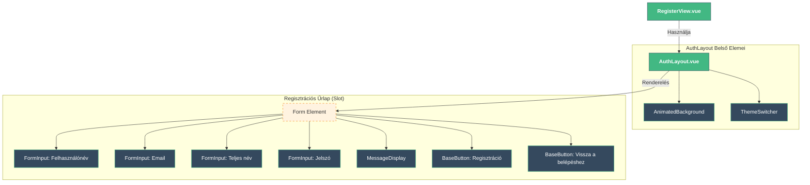
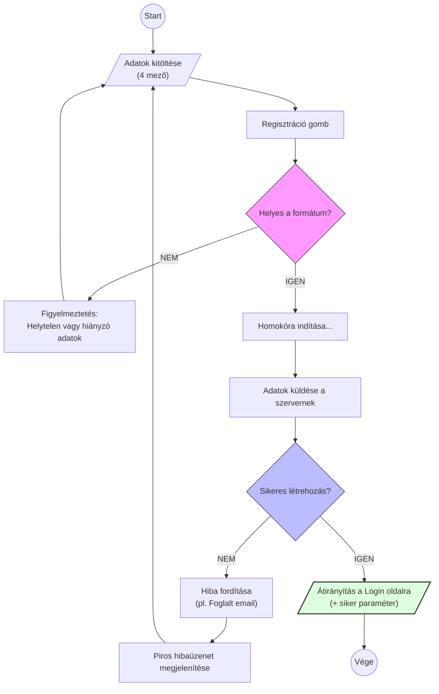

# RegisterView.vue

## 1. Áttekintés

A **RegisterView** az új felhasználók regisztrációs felülete. Ez az oldal teszi lehetővé a fiók létrehozását a rendszerben. Mivel a regisztráció több adatot igényel, a komponens kiemelt figyelmet fordít a valós idejű validációra és a felhasználói hibák megelőzésére.

* **Típus:** Page Component (Auth)
* **Útvonal:** `/register` (feltételezett)
* **Szülő Layout:** `AuthLayout.vue`

## 2. Felépítés és Architektúra

A komponens felépítése megegyezik a többi hitelesítési oldallal, biztosítva a vizuális konzisztenciát. A "Smart Component" megközelítés itt is érvényesül: a `RegisterView` kezeli a logikát, míg a megjelenítést a közös komponensek végzik.

### 2.1 Komponens Hierarchia

A diagram a `RegisterView` szerkezetét mutatja. Mivel az `AuthLayout` vissza gombja itt sincs aktiválva, a navigációt az űrlap alján lévő gomb biztosítja.



## 3. Üzleti Logika (`<script setup>`)

A logika a `useAuth` composable `register` függvényére épül. A legfontosabb különbség a Login oldalhoz képest, hogy sikeres regisztráció esetén nem a Dashboardra, hanem a Login oldalra irányítjuk a felhasználót.

### 3.1 Folyamatvezérlés (Flowchart)

Az alábbi ábra bemutatja, hogyan kezeli a rendszer a regisztrációs kérést, beleértve a validációt és a visszajelzéseket.



### 3.2 Validáció és Szabályok

Mivel ez a legösszetettebb űrlap, szigorú validációs szabályok (`rules`) érvényesülnek, melyek a `validation-messages.js`-ből származnak:

1. **Felhasználónév (`username`):** Egyedinek és megfelelő hosszúságúnak kell lennie.
2. **Email (`email`):** Szabványos email formátum.
3. **Teljes név (`fullName`):** Kötelező mező (a profil megjelenítéshez).
4. **Jelszó (`password`):** Erős jelszó követelmények (hossz, karaktertípusok).

A `validateField` függvény gondoskodik róla, hogy a felhasználó azonnal visszajelzést kapjon (`@blur` eseményre), ha valamit elrontott, még mielőtt elküldené az űrlapot.

### 3.3 Navigáció és Átirányítás

Sikeres regisztráció esetén a kód nem jelenít meg helyi sikerüzenetet, hanem azonnal átirányít:

```javascript
navigateToLogin({ registered: '1' })

```

Ez magyarázza a `LoginView`-nál látott `checkQueryMessages` logikát: a regisztrációs oldal "átadja a labdát" a bejelentkezési oldalnak, amely az URL paraméter (`registered=1`) alapján írja ki a felhasználónak, hogy *"Sikeres regisztráció, most már beléphetsz"*.

## 4. Felhasználói Felület (`<template>`)

A template négy `FormInput` komponenst tartalmaz, mindegyik saját validációs állapottal (`:error`).

* **Mezők:**
* `username` (text)
* `email` (email)
* `fullName` (text)
* `password` (password - rejtett)


* **Visszajelzés:** A `MessageDisplay` komponens itt csak a szerveroldali hibák (pl. *"Ez az email cím már foglalt"*) megjelenítésére szolgál, mivel a siker esetén átirányítás történik.

## 5. Stílus (CSS)

Ahogy a többi hitelesítési oldalnál, itt is az `@/assets/auth-common.css` biztosítja az egységes megjelenést. A `.register-container` osztály gondoskodik a megfelelő térközökről, hogy a hosszabb űrlap is áttekinthető maradjon mobilon és desktopon egyaránt.