# ResetPasswordView.vue

## 1. Áttekintés

A **ResetPasswordView** a jelszó-helyreállítási folyamat befejező lépése. Ez az oldal csak akkor jelenik meg helyesen, ha a felhasználó egy érvényes, tokent tartalmazó linkre kattintott az emailjében. A felület célja az új jelszó biztonságos megadása és megerősítése.

* **Típus:** Page Component (Auth)
* **Útvonal:** `/reset-password?token=...`
* **Előfeltétel:** Érvényes token jelenléte az URL-ben.
* **Szülő Layout:** `AuthLayout.vue`

## 2. Felépítés és Architektúra

A komponens felépítése követi a többi auth oldal mintáját, de az űrlap logikája itt speciális (jelszóegyezés figyelése).

### 2.1 Komponens Hierarchia

A diagram a `ResetPasswordView` szerkezetét mutatja. Mivel az `AuthLayout` vissza gombja itt sincs konfigurálva, a navigációt a kártya alján lévő gomb biztosítja.

## 3. Üzleti Logika (`<script setup>`)

A logika két fő pilléren nyugszik: az URL-ben érkező token ellenőrzésén és a két jelszómező szinkronizált validációján.

### 3.1 Életciklus: Token Ellenőrzés (`onMounted`)

Az oldal betöltésekor (`onMounted`) a kód azonnal kiolvassa a tokent az útvonalból (`route.query.token`).

* **Ha nincs token:** A `setError('Érvénytelen token')` hívással azonnal piros hibaüzenet jelenik meg, és a felhasználó nem tudja használni az űrlapot.
* **Ha van token:** A felhasználó megkezdheti a kitöltést.

### 3.2 Folyamatvezérlés (Flowchart)

Az alábbi ábra bemutatja a jelszócsere teljes menetét, beleértve a speciális 3 másodperces késleltetést a siker után.

### 3.3 Validáció és Szabályok

A `validateField` függvény itt egy speciális szabályt alkalmaz a második mezőre:

1. **Password:** Normál jelszóerősség ellenőrzés.
2. **ConfirmPassword:** Egyedi validátor függvényt futtat (`fieldValidators.passwordConfirm`), amely összehasonlítja a beírt értéket az első jelszó mező értékével (`formData.password`). Ha nem egyeznek, azonnal hibát jelez.

### 3.4 Sikerkezelés és Időzítés

Sikeres API válasz esetén a felhasználói élmény javítása érdekében:

1. **Visszajelzés:** Megjelenik a "Jelszó sikeresen megváltoztatva!" üzenet.
2. **Törlés:** A jelszó mezők kiürülnek biztonsági okokból.
3. **Késleltetés:** A `setTimeout` 3000 ms (3 másodperc) várakozást iktat be az átirányítás előtt, hogy a felhasználónak legyen ideje elolvasni a sikerüzenetet.

## 4. Felhasználói Felület (`<template>`)

A felület két `FormInput` (`type="password"`) komponenst tartalmaz.

* **Jelszó megerősítése:** Ez a mező vizuálisan ugyanolyan, mint az első, de a logikája biztosítja, hogy a felhasználó ne írhassa el véletlenül az új jelszavát.
* **Gombok:**
* `primary`: Jelszó beállítása (küldés).
* `ghost`: Vissza a bejelentkezéshez (ha a felhasználó meggondolná magát, vagy lejárt a token).

## 5. Stílus (CSS)

A komponens az egységes `@/assets/auth-common.css` fájlt használja. A `.reset-container` osztály biztosítja a megfelelő méretezést, ami megegyezik a többi auth kártya megjelenésével, így a felhasználó egy koherens rendszerben érzi magát a teljes folyamat során.