# Eredmény Összesítő Modul (Results Dashboard) Specifikáció

## 1. Tervezési Filozófia: Progresszív Feltárás (Progressive Disclosure)

A `ResultsPage` komponens a felhasználói élmény (UX) maximalizálása érdekében szakított a hagyományos "mindent vagy semmit" adatmegjelenítéssel. Ehelyett a **Progresszív Feltárás** elvét követi, amely három fő fázisra bontja a felhasználói életutat.

A rendszer célja a **kognitív terhelés csökkentése** és az **azonnali jutalmazás**:

1. **Zero State (0/2):** Motiválás a kezdésre.
2. **Partial State (1/2):** Azonnali értékadás a kész elemzéssel, a figyelem elterelése nélkül.
3. **Complete State (2/2):** A teljes kép (szinergia) bemutatása.

### 1.1. UI Állapotgép (State Machine)

Az alábbi állapotdiagram a felület lehetséges vizuális állapotait és az azok közötti átmeneteket mutatja be.

---

## 2. Dinamikus Navigációs Motor

A komponens "agya" a `availableTabs` számított tulajdonság (`computed property`), amely valós időben generálja a navigációs struktúrát. Ez a logika biztosítja, hogy a felhasználó soha ne lásson inaktív vagy üres felületeket.

### 2.1. Fülek Generálási Algoritmusa

A rendszer egy additív logikát követ. Nem rejteget meglévő füleket, hanem az állapot alapján építi fel a tömböt.

---

## 3. Intelligens Aktív Fül Kiválasztás (Smart Routing)

Nem elég megjeleníteni a füleket; a rendszernek el kell döntenie, melyik legyen az aktív, amikor a felhasználó megérkezik az oldalra. Ezt a `determineInitialTab` metódus végzi, amely figyelembe veszi a felhasználó szándékát (URL paraméterek) és a rendelkezésre álló adatokat.

**A prioritási sorrend:**

1. **Explicits kérés:** Ha az URL tartalmazza a `?tab=skin` paramétert (Deep Link), és az a fül elérhető, a rendszer odaugrik.
2. **Szinergia nézet:** Ha minden elemzés kész, alapértelmezetten az "Áttekintés" (Combined) nézet nyílik meg, mivel ez nyújtja a legnagyobb értéket.
3. **Kényszerített fókusz:** Ha csak egy elemzés van kész (pl. Bőr), a rendszer automatikusan azt nyitja meg, megspórolva egy kattintást.

---
Rendben, itt a **4. fejezet jelentősen kibővített, szakdolgozati mélységű változata**. Ebben a verzióban nem csak a folyamatot írjuk le, hanem részletesen indokoljuk a tervezési döntéseket (miért jó ez a hibrid megoldás), kitérünk az aszinkron adatkezelés nehézségeire és a rendszer hibatűrési képességeire is.

---

## 4. Hibrid Adatbetöltési és Hibatűrő Stratégia (Hybrid Data Fetching & Fault Tolerance)

A modern webes alkalmazások egyik kritikus pontja az adatbetöltés megbízhatósága. A `ResultsPage` komponens esetében a **Hibrid Adatbetöltési Stratégia** került implementálásra, amely ötvözi a dinamikus backend szolgáltatások rugalmasságát a statikus tartalomszolgáltatás sebességével és stabilitásával.

Ez a megközelítés strukturálisan szétválasztja a **Diagnózist** (amely felhasználó-specifikus és dinamikus) a **Protokolltól** (amely tudásbázis jellegű és statikus).

### 4.1. Architektúrális Megfontolások

A `loadResults` metódus nem egy egyszerű adatlekérő függvény, hanem egy **orkesztrátor**, amely dinamikusan dönti el, hogy az alkalmazás megjelenítési rétege honnan jusson hozzá a szükséges információkhoz. A stratégia három fő pillérre épül:

1. **Backend-First megközelítés:** A rendszer elsődlegesen a központi API-ra támaszkodik. Ez biztosítja, hogy a diagnózis (pl. "Zsíros bőr") mindig hiteles és naprakész legyen.
2. **Graceful Degradation (Elegáns leépülés):** Ha a backend API válasza hiányos (pl. csak a diagnózist küldi, de a hozzá tartozó hosszú szöveges leírást nem), a rendszer nem omlik össze. Ehelyett automatikusan aktivál egy "B-tervet" (Fallback mechanism), és kliensoldali erőforrásokból pótolja a hiányzó adatokat.
3. **Hálózati Optimalizáció:** A statikus protokollok (JSON fájlok) különválasztása lehetővé teszi azok CDN-en (Content Delivery Network) keresztüli gyorsítótárazását, csökkentve a fő alkalmazásszerver terhelését.

### 4.2. A Betöltési Folyamat Részletes Elemzése

Az alábbi folyamatábra a `loadResults` aszinkron végrehajtási láncát szemlélteti. A folyamat lépései a következők:

1. **Inicializálás és UI Védelem:**
A folyamat a `Loading State` aktiválásával kezdődik. Ez technikai szempontból kritikus, mivel megakadályozza a "Cumulative Layout Shift" (CLS) jelenséget, azaz az oldal elemeinek ugrálását az adatok beérkezése közben.
2. **Kritikus Adatok Lekérése (Core Fetch):**
A kliens elindítja a `GET /analyses-results` hívást. Ez a lépés "single point of failure": ha ez a hívás sikertelen (pl. 500-as hiba), a folyamat megáll, mivel diagnózis nélkül nem lehet protokollt megjeleníteni.
3. **Protokoll Rezolúció (Resolution Logic):**
Ez a folyamat legintelligensebb része. A rendszer megvizsgálja a beérkező adatcsomagot (`payload`).
* **1. ág: API-vezérelt tartalom:** Ha a válasz tartalmazza a `protocol` objektumot, a rendszer azonnal ezt használja. Ez az ideális eset, mivel nem igényel további hálózati köröket.
* **2. ág: Kliens-oldali Fallback:** Ha a `protocol` mező üres vagy `null`, a rendszer a diagnózis eredménye (pl. `skinType: 'oily'`) alapján dinamikusan generál egy elérési utat (`/protocols/skin/oily.json`). Ezután egy újabb, párhuzamosított aszinkron kéréssel (`fetch`) betölti a statikus fájlt.

4. **Adatfúzió (Data Merging):**
A folyamat végén a különböző forrásból (API és/vagy JSON fájl) származó adatok egyetlen reaktív állapotobjektumban egyesülnek. A Vue.js reaktivitási rendszere érzékeli ezt a változást, és elindítja a DOM frissítését, valamint a fülek (`tabs`) újraszámolását.

### 4.3. A Stratégia Előnyei

Ennek a hibrid architektúrának a bevezetése több mérhető előnnyel jár a rendszer működésére nézve:

* **Magas Rendelkezésre Állás (High Availability):** A rendszer akkor is képes teljes értékű bőrápolási tanácsokat adni, ha a backend adatbázisának "Content" táblái átmenetileg elérhetetlenek, vagy ha hálózati hiba miatt az adatcsomag sérül. A diagnózis megléte elegendő a működéshez.
* **Decoupling:** A diagnosztikai logika (backend) és a tartalmi logika (szövegezés) elválik egymástól. A marketing vagy szakmai csapat frissítheti a JSON fájlokat (pl. új termékajánlók) anélkül, hogy a backend kódot vagy az adatbázis-sémát módosítani kellene.
* **Skálázhatóság:** Mivel a statikus JSON fájlok kiszolgálása minimális szervererőforrást igényel (és könnyen cache-elhető), a rendszer jobban bírja a nagy terhelést, mintha minden egyes oldalletöltéskor komplex adatbázis-lekérdezéseket (JOIN műveleteket) kellene futtatni a protokollszövegek összeállításához.