# Komponens Specifikáció: CombinedProtocolView (A Szintézis Nézet)

A `CombinedProtocolView` a rendszer **kimeneti végpontja** és egyben legértékesebb funkcionális eleme. Ez a modul valósítja meg az alkalmazás alapígéretét: a holisztikus szépségápolási tanácsadást.

Technikai értelemben ez egy **magas szintű aggregátor komponens**, amely két, egymástól független adathalmazt (Dermatológiai profil és Kolorimetriai profil) olvaszt össze egyetlen, gyakorlatias cselekvési tervvé.

## 1. Architektúra és Tervezési Minta

A komponens a **"Smart Service / Dumb Component"** (Okos Szolgáltatás / Buta Komponens) tervezési mintát követi.

* **Felelősségi kör (Scope):** A komponens kizárólag a **megjelenítésért (Rendering)** felel. Nem tartalmaz üzleti logikát, nem végez számításokat, és nem hív API-t.
* **Adatforrás:** A "nyers" adatokat `props`-okon keresztül kapja a szülő komponenstől (`ResultsPage`).
* **Transzformáció:** A bejövő adatok értelmezését a `synthesis.service.js` végzi. Ez biztosítja a **Separation of Concerns (SoC)** elvét: ha változik az összefésülési algoritmus, nem kell hozzányúlni a Vue fájlhoz.

### Adatfolyam Diagram (Data Flow)

Az ábra bemutatja, hogyan alakulnak át a bemeneti statikus adatok dinamikus, személyre szabott tanácsokká.



---

## 2. A Szintézis Motor (Synthesis Engine)

A nézet "lelke" a `synthesizedProfile` computed property. Ez nem egyszerű adatmegjelenítést végez, hanem egy **Dimenzió-keresztezést (Cross-Domain Mapping)** hajt végre.

A rendszer egy mátrixot képez a két profilból:

* **X tengely:** Színtípus (Pl. Ősz - Meleg, Tört színek)
* **Y tengely:** Bőrtípus (Pl. Zsíros - Fénylő, Tág pórusok)

**Konkrét példa a logikára:**
Ha a komponens azt a feladatot kapja, hogy "Ajánlj Pirosítót", az alábbi logikai kapukat futtatja le:

1. *Textúra szabály:* Mivel a bőr zsíros -> **Por állagú** (hogy ne fényesedjen).
2. *Szín szabály:* Mivel a típus Ősz -> **Barack/Téglavörös** árnyalat (hogy harmonizáljon).
3. *Eredmény:* "Por állagú, matt téglavörös pirosító".

Ez a logika a háttérben fut, a komponens már csak a kész `SmartMakeupRoutine` objektumot kapja meg.

---

## 3. Komponens Anatómia és UI Struktúra

A felület felépítése a **felhasználói figyelem vezetését** szolgálja, az általánostól a konkrét termékek felé haladva. A template defenzív módon épül fel: minden szekció `v-if` feltétellel védett, így hiányos adatok esetén sem törik el a layout.

### 1. Hero Szekció (Identitás)

* **Funkció:** Vizuális megerősítés.
* **Design:** Badges (Jelvények) használata a két diagnózis (Szín + Bőr) megjelenítésére, elválasztó vonallal, ami a "két fél eggyé válását" szimbolizálja.

### 2. Aranyszabály (The Golden Rule)

* **Kiemelés:** Külön "ARANYSZABÁLY" címkével ellátott doboz.
* **Cél:** A legfontosabb üzenet átadása (pl. "Meleg színek matt textúrával"). Ez az az egy mondat, amire a felhasználónak emlékeznie kell, ha semmi mást nem olvas el.

### 3. Szinergia Kártyák (Oktatási Réteg)

Ez a rész magyarázza meg a *miérteket*.

* **Dinamikus Színezés:** A kártyák `accent-color` prop-ot fogadnak, így a szegélyszínük (`border-left`) vizuálisan kódolja a témát (Arc = Sárga, Száj = Piros, stb.).
* **Struktúra:** Minden kártya külön-külön lebontja, mit ad hozzá a bőrtípus és mit a színtípus az adott területhez.

### 4. Okos Sminkrutin (Smart Makeup Routine)

Ez a legkomplexebb alkomponens.

* **Grid Layout:** CSS Grid-et használ (`repeat(auto-fit, ...)`) a reszponzivitás érdekében.
* **Highlighter Alert:** Egy speciális logikai blokk. Zsíros bőr esetén a rendszer automatikusan generál egy `warning-box`-ot ("Figyelem: kerüld a T-zónát!"), ami vizuálisan is eltér (piros háttér) a többi tanácstól.

### 5. Színkorrekció (Feltételes Renderelés)

* **Logika:** Csak akkor jelenik meg (`v-if="synthesizedProfile?.skincareColorCorrection"`), ha van mit korrigálni.
* **Példa:** Ha valaki "Rosaceás" (pirosodás) de "Meleg tónusú", a rendszer zöld korrektort ajánl, de figyelmeztet, hogy ez hogyan módosítja az alapozó színét.

---

## 4. Technikai Megoldások: Robusztusság és Adapterek

A kód egyik legfontosabb mérnöki megoldása az **Adapter Pattern** alkalmazása a JSON adatok feldolgozásánál.

```javascript
const seasonProtocolData = computed(() => {
  if (!props.seasonProtocol) return null
  // Robusztus kulcskeresés
  const key = Object.keys(props.seasonProtocol).find(k => k.includes('ColorAnalysisProfile'))
  return key ? props.seasonProtocol[key] : null
})

```

**Probléma:**
A statikus JSON fájlok szerkezete verzióról verzióra változhat. Lehet, hogy ma a gyökérkulcs `ColorAnalysisProfile_v1`, holnap `ColorAnalysisProfile_v2`.
**Megoldás:**
A kód nem drótozza be (`hardcode`) a kulcs nevét. Ehelyett megkeresi azt a kulcsot, ami *tartalmazza* a "ColorAnalysisProfile" szót. Ez a **"Fuzzy Matching"** technika drasztikusan csökkenti a kliensoldali hibák számát adatstruktúra-váltáskor.

---

## 5. Stílusrendszer (SCSS Architektúra)

A komponens stílusozása moduláris és témázható.

1. **Mixin-ek használata:** A `@include flex-col`, `@include label-style` használata biztosítja a konzisztenciát az egész alkalmazásban.
2. **Szemantikus Színek:** Nem hex kódokat használ közvetlenül, hanem CSS változókat (`var(--secondary-500)`), ami lehetővé teszi a központi témavezérlést.
3. **Dark Mode Támogatás:** A `:global(.theme-dark)` blokkok felülírják a komponens színeit sötét módban.
* *Különlegesség:* A figyelmeztető dobozok (`warning-box`) háttere sötét módban átlátszóbb (`rgba`), hogy ne legyen túl kontrasztos a sötét háttéren.


