# SeasonProtocolView 

A `SeasonProtocolView` a Kolorimetriai Elemzés (Color Analysis) eredményeinek dedikált megjelenítő felülete. A komponens célja, hogy a száraz elméleti adatokat (hexakódok, tiltólisták) egy **esztétikus, digitális divatmagazin** élményévé alakítsa át.

## 1. Architektúra

A komponens szigorúan **Prezentációs (Dumb)** szerepkörben működik. Nem végez elemzést, feladata kizárólag a `ResultsPage`-től kapott nyers JSON adatstruktúra vizualizációja.

### Adatfeldolgozási Logika (The Adapter)

A komponens egy belső **Normalizációs Réteget** tartalmaz a `protocolData` computed property formájában.

```javascript
const protocolData = computed(() => {
  // Fuzzy Key Search: Megkeresi azt a kulcsot, ami tartalmazza a 'ColorAnalysisProfile' szöveget
  const key = Object.keys(props.protocol).find(k => k.includes('ColorAnalysisProfile'))
  return key ? props.protocol[key] : null
})

```

**Indoklás:** Ez a megoldás (Adapter Pattern) elszigeteli a nézetet a JSON séma esetleges verzióváltásaitól (pl. `ColorAnalysisProfile_v1` -> `ColorAnalysisProfile_v2`), biztosítva a rendszer hosszú távú stabilitását.


---

## 2. UI Struktúra és Vizuális Hierarchia

A felület tervezése a **"Storytelling" (Történetmesélés)** elvét követi: az absztrakt fogalmaktól halad a konkrét, kézzelfogható példák felé.

### 1. Filozófia Szekció (The Hook)

Az oldal teteje nem a színekkel, hanem az identitással kezd.

* **Essence Text:** A típus "lelkületét" írja le.
* **Golden Rule:** Kiemelt vizuális dobozban (`golden-rule`) jelenik meg a típus legfontosabb szabálya.
* **Tags:** Kulcsszavak (pl. "MELEG", "TÖRT", "MÉLY") gyors áttekintéshez.

### 2. Színpaletta Grid (The Core)

Ez a komponens leglátványosabb eleme.

* **Technológia:** CSS Grid-et használ **automatikus kitöltéssel** (`repeat(auto-fill, minmax(140px, 1fr))`).
* *Előny:* Ez a megoldás "Media Query-less" reszponzivitást biztosít. A kártyák automatikusan átrendeződnek a rendelkezésre álló szélesség függvényében, anélkül, hogy külön töréspontokat kellene definiálni.


* **Renderelés:** A színkörök (`swatch-circle`) hátterét dinamikus inline stílus (`:style="{ backgroundColor: color.hex }"`) állítja be közvetlenül az adatmodellből.

### 3. Split Layout (Practical Advice)

Az oldal alján a tartalom két hasábra oszlik (Desktop nézetben):

* **Bal oldal (Kerülendő):** Piros szegéllyel (`border-left: 3px solid #ef4444`) jelölt lista, amely pszichológiailag is a "Stop/Vigyázz" üzenetet közvetíti.
* **Jobb oldal (Kiegészítők):** Kompakt kártyák (`ProtocolCard`) az ékszerek és fémek bemutatására.



---

## 6.3. Stílusozás és Témakezelés

A komponens stílusa a **Glassmorphism** (üveghatás) és a **Material Design** elemeit ötvözi.

### Színhasználat és Gradients

A főcím (`main-title`) egyedi megoldást használ: a szöveg színét egy CSS gradiens adja (`-webkit-background-clip: text`), ami elegáns, prémium hatást kelt.

* *Sötét módban:* A gradiens színei automatikusan világosabb árnyalatokra váltanak (`secondary-400` -> `secondary-300`), hogy megmaradjon a kontraszt a sötét háttéren.

### Interaktivitás

A színminták (`color-swatch-card`) finom mikro-interakciókkal rendelkeznek:

* **Hover Effect:** Az elem megemelkedik (`translateY(-3px)`), jelezve, hogy ez egy interaktív, fókuszálható elem.
* **Shadow:** A színkörök alatt lágy árnyék van, ami térbeliséget ad a felületnek.

### Sötét Mód (Dark Mode) Stratégia

A komponens nem csak "invertálja" a színeket, hanem **adaptálja** azokat:

* **Opacitás:** A fehér hátterek helyett félig átlátszó (`rgba(255, 255, 255, 0.05)`), elmosott háttereket használ.
* **Színkorrekció:** A piros "Kerülendő" dobozok sötét módban alacsonyabb telítettségű hátteret kapnak, hogy ne legyenek bántóan neon-hatásúak ("szemkímélő vörös").