# Komponens Specifikáció: SkinProtocolView (Bőrdiagnosztikai Motor)

A `SkinProtocolView` a rendszer legösszetettebb megjelenítő modulja, amely a bőrgyógyászati szakértői rendszer frontend oldali leképezését valósítja meg. Míg a színtípus elemzés statikus (determinisztikus), addig a bőrdiagnosztika **dinamikus és rétegzett**: egy alap bőrtípushoz (pl. Zsíros) tetszőleges számú, időben változó bőrprobléma (pl. Akne, Vízhiány, Rozácea) társulhat.

Ez a komponens nem csupán renderelést végez, hanem **kliensoldali adatfúziót (Client-Side Data Fusion)** hajt végre, hogy a széttagolt adatforrásokból egyetlen, koherens és végrehajtható útmutatót hozzon létre.

## 1. Architektúra: Kettős Adatfolyam és Egyesítés (Dual Stream Architecture)

A komponens belső logikája egy **"Master + Overlay"** (Mester + Rávetítés) architektúrára épül. A megjelenítési motor két, egymástól független adatforrást dolgoz fel és fésül össze valós időben.

### Az adatfeldolgozás lépései:

1. **Mester Réteg (Base Layer):** A genetikai bőrtípus (pl. `oily`, `dry`) határozza meg a gerincet: a tisztítás, hidratálás és fényvédelem alapszabályait. Ezt a `protocol` prop-ból nyeri ki a rendszer a `MasterProtocol` kulcs normalizálásával.
2. **Rávetített Réteg (Overlay Layer):** A felhasználó által detektált bőrproblémák (`skinProblems` tömb) határozzák meg a korrekciós lépéseket.
3. **Összefésülés (The Join Operation):** A `problemsWithProtocol` számított mező (`computed property`) egy valós idejű relációs műveletet végez:
* **Input:** A felhasználó problémáinak listája (pl. `['acne', 'dehydrated']`).
* **Lookup:** Kikeresi a teljes tudásbázisból (`problemsProtocol`) a releváns al-protokollokat.
* **Output:** Egy tisztított, iterálható objektumtömböt állít elő, kizárva a hiányzó vagy sérült adatokat.

## 2. Intelligens Rutin Renderelés és Parser Logika

A bőrápolási rutinok megjelenítése során a komponens nem statikus szövegeket jelenít meg, hanem egy strukturált adatmodellt vizualizál. Mivel a backend technikai azonosítókat használ (hogy az adatbázis konzisztens maradjon), a frontend feladata a "humanizálás".

### Parser és Formázó Algoritmusok:

A `<script setup>` blokkban található helper függvények felelősek a nyers kulcsok átalakításáért:

* **Regex Step Extraction (`extractStepNumber`):** A `step(\d+)` mintaillesztéssel kinyeri a sorszámot a kulcsból (pl. `step1_cleansing` -> `1`). Ezt használja a UI a kör alakú badge-ek generálásához.
* **Name Formatting (`formatStepName`):** Eltávolítja a technikai prefixeket (`step1_`, `_method`) és CamelCase -> Title Case konverziót végez, hogy a felhasználó számára olvasható címsorokat kapjunk ("Cleansing Foam" a "step1_cleansing_foam" helyett).

### Szemantikus Megjelenítés:

* **Reggeli Rutin:** Kék/Világos tónusú badge-eket használ (`var(--secondary-100)`), pszichológiailag a frissességre és a napindításra utalva.
* **Esti Rutin:** Sötét/Lila tónusú badge-eket (`.step-badge.dark`) használ, vizuálisan elkülönítve a regeneráló, éjszakai fázist.

## 3. Dinamikus Bőrprobléma Kezelés (Iteratív UI)

Ez a modul a komponens legrugalmasabb része. Mivel a bőrproblémák száma és jellege felhasználónként eltérő, a renderelés egy `v-for` cikluson alapuló iteratív folyamat.

A megjelenítés itt a **Pszichológiai Színkódolás (Psychological Color Coding)** elvét követi a hatékony információátadás érdekében:

1. **Diagnózis és Definíció:** Minden probléma egy kontextuális leírással (`def-text`) indul.
2. **Vizuális Tünetek (Visual Diagnostics):**
* **Piros (`#ef4444`):** A tünetek felsorolása. A piros szín figyelemfelkeltő, segít a felhasználónak azonosítani a problémát a tükörben.
* **Narancs (`#f97316`):** Lokáció (Hol jelenik meg?). A narancs szín a területi figyelmeztetésre utal.

3. **Tiltólista (Negative Space):**
* A "Mit NE tegyél" szekció kritikus fontosságú a biztonság szempontjából.
* **Implementáció:** A `warning-text` CSS osztály és a sötétvörös (`#dc2626`) akcentus szín azonnali óvatosságra inti a felhasználót.

4. **Megoldásorientált Kártyák:**
* A kezelési tanácsok (Tisztítás, Eszközök) nyugtató, hideg színeket (zöld, kék, türkiz) használnak, sugallva a megoldást és a terápiát.

## 4. Reszponzív Layout és Grid Stratégia

A komponens layout-ja a CSS Grid technológiára támaszkodik, hogy az információ sűrűségétől függetlenül esztétikus elrendezést biztosítson minden eszközön.

### Alkalmazott Grid Technológiák:

1. **Összetevő Felhő (Ingredient Cloud):**
* A `repeat(auto-fill, minmax(200px, 1fr))` szabály használata biztosítja, hogy a kártyák kitöltsék a rendelkezésre álló teret. Ha a konténer szűkül, a kártyák automatikusan új sorba tördelődnek anélkül, hogy a tartalmuk sérülne.

2. **Split-Screen Rutin Nézet (Comparison View):**
* **Mobil (<768px):** A Reggeli és Esti rutin egymás alatt helyezkedik el (lineáris olvasás), optimalizálva a görgetésre.
* **Desktop (≥768px):** A rutinok egymás mellé kerülnek (`grid-template-columns: 1fr 1fr`). Ez a **Compare Layout** lehetővé teszi a felhasználó számára a napszakok gyors összehasonlítását (pl. "Reggel C-vitamin, Este Retinol").

## 5. Hibatűrés és Defenzív Programozás

A komponens robusztusságát (Robustness) egy többrétegű védelmi rendszer biztosítja, amely megakadályozza a futásidejű hibákat hiányos adatok esetén.

1. **Opcionális Props és Default Értékek:**
* A `problemsProtocol` és `skinProblems` prop-ok alapértelmezett értéke `null` vagy üres tömb. Így a komponens önállóan, "csökkentett módban" is képes működni, ha csak az alaptípust kell megjeleníteni.

2. **Null-Safety a Template-ben:**
* Minden mélyen beágyazott objektum (pl. `protocolData.profileDiagnostics.sensoryAnalysis`) elérése `v-if` feltételekkel védett. Ez garantálja, hogy a renderelés nem áll le "White Screen of Death" hibával, ha a backend API válasza hiányos.

3. **Graceful Degradation (Elegáns Leépülés):**
* A rutin lépéseknél (Step Detail) a rendszer csak azokat a mezőket rendereli, amelyek léteznek. Ha egy lépésnél nincs "Tipp" vagy "Technika", a kártya automatikusan kompaktabbá válik, elkerülve az üres, "undefined" feliratú sorokat.