# Kliensoldali Útvonalkezelés és Hozzáférés-vezérlés (Router)

## 1. Modul Definíció és Hatókör

Ez a modul (`src/router/index.js`) felelős az Egoldalas Alkalmazás (SPA - Single Page Application) **kliensoldali navigációs logikájának** megvalósításáért. A `Vue Router 4` könyvtárra épülve biztosítja az URL-állapot és a nézetkomponensek (View Components) közötti szinkronizációt, valamint implementálja a globális hozzáférés-vezérlési (Access Control) házirendet.

**Technikai specifikációk:**

* **History Mode:** `createWebHistory` – Az alkalmazás a HTML5 History API-t használja, amely biztosítja a tiszta, hash-mentes URL-eket (pl. `/login` a `/#/login` helyett) és a megfelelő böngésző-előzmény kezelést.
* **Architektúra:** Lapos útvonal-szerkezet (Flat Routing Structure), amely egyszerűsíti a komponensek életciklus-kezelését és a védelmi logikát.

## 2. Útvonal-architektúra (Route Map)

Az alkalmazás végpontjai két logikai zónára oszthatók: a **Publikus Hitelesítési Zónára** és a **Védett Alkalmazási Zónára**. A szegregációt az útvonal-metaadatok (`route meta fields`) vezérlik.

### 2.1 Útvonal-definíciók

Az alkalmazás végpontjai hozzáférési szint szerint kategorizálva kerülnek definiálásra:

#### **A) Publikus Hitelesítési Végpontok**

Ezen útvonalak eléréséhez nem szükséges előzetes azonosítás. A rendszer itt kezeli a munkamenet (session) indítását és helyreállítását.

* **`/` (Root)**
* **Funkció:** Belépési pont kezelése.
* **Viselkedés:** Automatikus redirekció a `/login` végpontra (kivéve, ha az alkalmazás állapota mást indokol).


* **`/login`**
* **Komponens:** `LoginPage`
* **Funkció:** Felhasználói hitelesítés, JWT token akvizíció és tárolás.


* **`/register`**
* **Komponens:** `RegisterPage`
* **Funkció:** Új felhasználói fiók regisztrációja és validációja.


* **`/forgot-password`**
* **Komponens:** `ForgotPasswordPage`
* **Funkció:** Jelszó-helyreállítási folyamat kezdeményezése (email küldés).


* **`/reset-password`**
* **Komponens:** `ResetPasswordPage`
* **Funkció:** Végleges jelszócsere érvényes token birtokában.



#### **B) Védett Alkalmazási Végpontok**

Ezen erőforrások szigorúan védettek. A hozzáférés feltétele a `meta: { requiresAuth: true }` flag megléte és az érvényes hitelesítési token.

* **`/dashboard`**
* **Komponens:** `DashboardPage`
* **Funkció:** Központi vezérlőpult, az alkalmazás fő navigációs csomópontja.


* **`/profile`**
* **Komponens:** `ProfilePage`
* **Funkció:** Felhasználói profiladatok megtekintése és szerkesztése.


* **`/chat`**
* **Komponens:** `AIChatPage`
* **Funkció:** Interaktív AI asszisztens interfész (LLM integráció).


* **`/skin-analysis`**
* **Komponens:** `SkinAnalysisPage`
* **Funkció:** Bőrelemzési folyamat és diagnosztika.


* **`/results`**
* **Komponens:** `ResultsPage`
* **Funkció:** Elemzési eredmények és előzmények vizualizációja.                                      

### 2.2 Strukturális Diagram



## 3. Biztonsági Navigációs Őr (Global Navigation Guard)

Az alkalmazás integritását egy globális `beforeEach` hook (interceptor) biztosítja. Ez a függvény minden navigációs esemény előtt lefut, és determinisztikus döntést hoz a tranzakció engedélyezéséről vagy elutasításáról.

### 3.1 Hitelesítési Logika

A rendszer a `localStorage`-ban perzisztált hitelesítési token (`authToken`) és felhasználói objektum (`authUser`) jelenlétét tekinti a jogosultság bizonyítékának.

A navigációs őr két elsődleges szabályrendszert érvényesít:

1. **Erőforrás-védelem (Resource Protection):**
* **Feltétel:** A célútvonal metaadatai között szerepel a `requiresAuth: true`.
* **Ellenőrzés:** Rendelkezik-e a kliens érvényes tokennel és felhasználói adattal?
* **Beavatkozás:** Hiányzó hitelesítési adatok esetén a rendszer megszakítja a navigációt, és a felhasználót a `/login` végpontra kényszeríti (Force Redirect).


2. **Redundáns Navigáció Megelőzése (UX Optimization):**
* **Feltétel:** A felhasználó hitelesített (van tokenje), de publikus auth-oldalt (Login/Register) próbál megnyitni.
* **Beavatkozás:** A rendszer felismeri, hogy a művelet felesleges, és automatikusan átirányítja a felhasználót a `/dashboard` felületre.


### 3.3 Implementációs Részletek

A kód implementációja szigorú típusellenőrzést és "fail-safe" működést valósít meg. A rendszer bináris (Hitelesített / Nem hitelesített) állapotokkal dolgozik a biztonság maximalizálása érdekében.

```javascript
// Részlet a router.beforeEach implementációból
if (requiresAuth) {
  // Szigorú ellenőrzés: mindkét tételnek (token + user) jelen kell lennie
  if (!token || !user) {
    console.warn('Access denied: Authentication required') // Audit log
    next('/login')
    return // A végrehajtási szál megszakítása
  }
}

```