# Szolgáltatás Réteg (Service Layer) és Hálózati Architektúra

## 1. Architektúrális Áttekintés

A modul (`src/services/index.js`) az alkalmazás kommunikációs gerince. Feladata a **frontend** (Vue komponensek) és a **backend** (REST API) közötti csatolás (coupling) lazítása. A réteg a **"Facade"** és **"Adapter"** tervezési mintákat ötvözi, hogy egységes interfészt biztosítson az adatlekérésekhez, függetlenül a háttérrendszer komplexitásától.

**Tervezési Célok:**

1. **DRY (Don't Repeat Yourself):** A hitelesítés és hibakezelés központosítása.
2. **Type Safety (jellegű) működés:** Egységes válaszstruktúra (`{ success, data/error }`) garantálása.
3. **Állapotmenedzsment leválasztása:** A témakezelés (ThemeService) kiszervezése a Vue reaktivitási köréből a jobb teljesítmény érdekében.

---

## 2. Hálózati Kliens Konfiguráció (Network Core)

Az alkalmazás egy egyedi konfigurációjú `axios` példányt (`apiClient`) használ Singletonként.

### 2.1 Környezeti Konfiguráció

A `baseURL` dinamikus injektálása a `import.meta.env.VITE_API_BASE_URL` változóból történik. 

### 2.2 Request Interceptor 


**Mérnöki megfontolások a kódban:**

* **Token Injektálás:** Minden kérésnél automatikusan ellenőrzi a `localStorage`-t. Ez megszünteti a szükségességet, hogy a komponensek manuálisan adják át a tokent.
* **Intelligens Content-Type:**
* *Alapeset:* `application/json` a JSON kommunikációhoz.
* *Kivétel:* Ha a payload `FormData` példány (pl. `aiService.chatWithImage` esetén), a fejlécet **törölni kell** (vagy nem beállítani). Miért? Mert ilyenkor a böngészőnek kell automatikusan generálnia a `multipart/form-data` fejlécet a megfelelő `boundary` paraméterrel együtt. Ha ezt felülírnánk fix JSON-ra, a szerver nem tudná feldolgozni a fájlt.

---

## 3. Hibakezelési Stratégia és API Wrapper

A nyers axios hívások helyett minden szolgáltatás az `apiCall` wrappert használja. Ez a függvény transzformálja a hálózati választ egy alkalmazás-specifikus eredményobjektummá.

### 3.1 Szabványosított Válasz Interface

A frontend komponensek sosem kapnak nyers HTTP Error-t (pl. 401, 500). Ehelyett egy determinisztikus struktúrát kapnak:

```javascript
// Siker esetén
{
  success: true,
  data: { ...payload } // A backend válasza
}

// Hiba esetén
{
  success: false,
  message: "ERROR_CODE_OR_MESSAGE", // Megjeleníthető hiba
  error: ErrorObj // Eredeti hiba a debugoláshoz
}

```

### 3.2 Error Resolution Hierarchy (Hiba Feloldási Rangsor)

A `apiCall` függvény kifinomult logikával dönti el, mit mutasson a felhasználónak. A prioritási sorrend:

1. **Backend Error Code (`error.response.data.errorCode`):** Ha a szerver strukturált hibakódot küld (pl. `USER_NOT_FOUND`), ez a legpontosabb.
2. **Backend Message (`error.response.data.message`):** Ha csak szöveges üzenet jön.
3. **Fallback Message (`errorMessage` paraméter):** A híváskor megadott alapértelmezett üzenet (pl. "AI chat hiba"), ha a szerver nem elérhető (Network Error).

### 3.3 Architektúrális Struktúra (Diagram)
Az alábbi diagram szemlélteti a réteg statikus felépítését. Látható, hogy a domain-specifikus objektumok (UserService, AIService) nem közvetlenül hívják az AxiosInstance-t, hanem az ApiWrapper absztrakción keresztül kommunikálnak, biztosítva az egységes működést.



Megjegyzés: A diagramon az <<Object>> sztereotípia jelzi a JavaScript objektum literálokat, míg a ThemeService valódi példányosítható ES6 osztály.
---

## 4. Domain Szolgáltatások Specifikációja

A szolgáltatások modulárisan, funkció szerint vannak csoportosítva.

### 4.1 AI Service (`aiService`)

Ez a modul kezeli a nagy számítási igényű, aszinkron LLM (Large Language Model) interakciókat.

* **Multimodális Kommunikáció:** A `chatWithImage` metódus Base64 kódolású képet továbbít JSON payload-ban.
* *Megjegyzés:* Bár a Base64 növeli a méretet kb. 33%-kal, egyszerűsíti a JSON API struktúrát a `multipart/form-data` kezeléséhez képest kisebb képeknél.


* **Kontextus-tudatosság:** A `conversationHistory` és `userContext` (pl. színtípus) minden kéréssel utazik..

### 4.2 User & Auth Services

A CRUD műveletek és a hitelesítés elkülönítése biztonsági szempontból előnyös (Separation of Concerns).

* **Biztonsági funkciók:**
* `changePassword`: PUT metódust használ (idempotens művelet).
* `deleteAccount`: DELETE metódust használ.
* `resetPassword`: Token alapú hitelesítést végez POST body-ban.


---

## 5. Téma Infrastruktúra (`ThemeService`)

Ez a legkomplexebb osztály a fájlban, amely teljes körű kliensoldali állapotkezelést valósít meg.

**Architektúra:** `Observer Pattern` (Megfigyelő minta) + `Singleton`.

### 5.1 Inicializálási Algoritmus (`init`)

A rendszer az alábbi vízesés-modell szerint dönti el, milyen témát alkalmazzon induláskor:

1. **Perzisztencia:** Van-e mentett `selected-theme` a LocalStorage-ban?
* *Igen*  Alkalmazás.


2. **Rendszer Preferencia:** Támogatja-e a böngésző a `prefers-color-scheme: dark` lekérdezést?
* *Igen*  Rendszer téma átvétele.


3. **Fallback:** Alapértelmezett `light` téma.
   


### 5.2 Rendszer-szintű Szinkronizáció

A `setupSystemThemeListener` metódus feliratkozik az operációs rendszer téma-váltási eseményére (`window.matchMedia(...).addListener`).

* **Viselkedés:** Ha a felhasználó átállítja a Windows/MacOS/Android témáját sötétről világosra, az webalkalmazás *automatikan* követi azt, **kivéve**, ha a felhasználó korábban manuálisan felülbírálta a beállítást (LocalStorage check).

### 5.3 DOM Manipuláció

A téma alkalmazása CSS változók (Custom Properties) szintjén történik két módszerrel a maximális kompatibilitásért:

1. **Dataset attribútum:** `document.documentElement.setAttribute('data-theme', ...)` (Modern CSS szelektorokhoz: `[data-theme="dark"]`).
2. **Class lista:** `document.documentElement.className = ...` (Régebbi keretrendszerek kompatibilitásához).

---

## 6. Kliensoldali Template Generálás

A `generatePasswordRecoveryTemplate` függvény a "Server-Side Rendering" (SSR) logikáját emeli át a kliensre.
---
