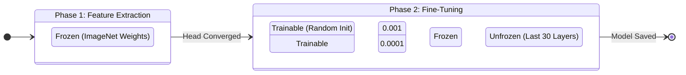

# Skin Problems Detector 

## Architektúra és Adattranszformáció

**Számítógépes Látás (Computer Vision)** alapú osztályozó rendszer, amely képes az emberi arcon megjelenő bőrgyógyászati elváltozások detektálására. A rendszer a **Transzfer Tanulás (Transfer Learning)** paradigmáját alkalmazza, egy ImageNet-en előtanított konvolúciós hálózat (CNN) tudását adaptálva a specifikus dermatológiai doménre.

## 1. Adatfeldolgozási Pipline (Data Pipeline)

A neurális hálózat bemenete nem nyers képadat, hanem egy szigorúan szabályozott transzformációs folyamat eredménye. A `skin_problems_train.py` szkript `ImageDataGenerator` osztálya definiálja ezt a csővezetéket.

### 1.1. Előfeldolgozás (Preprocessing)

A bemeneti képek (`Input Tensor`) az **EfficientNet** szabványnak megfelelő normalizáción esnek át.

* **Méret:** `224 x 224` pixel (RGB csatornák).
* **Skálázás:** A pixelértékek normalizálása a hálózat numerikus stabilitása érdekében (tipikusan `[-1, 1]` vagy `[0, 1]` tartományba, a `preprocess_input` implementációjától függően).

### 1.2. Valós Idejű Adatdúsítás (On-the-fly Augmentation)

Mivel a bőrgyógyászati adatkészletek gyakran korlátozott méretűek, a rendszer agresszív **Adatdúsítást (Data Augmentation)** alkalmaz a tanítási fázisban. Ez mesterségesen növeli a tanítóhalmaz varianciáját, így a modell robusztusabbá válik a fényviszonyok, a fej dőlésszöge és a kamera távolsága iránt.

**Alkalmazott transzformációk:**

1. **Rotation (`30°`):** Szimulálja a fej dőlését.
2. **Shift (`W/H 0.2`):** A kép eltolása vízszintesen/függőlegesen (ha a hiba nem középen van).
3. **Zoom (`0.2`):** Nagyítás/kicsinyítés (távolság szimulálása).
4. **Horizontal Flip:** Tükrözés (az arc szimmetriája miatt valid).



## 2. Modell Architektúra (Network Topology)

A modell egy hibrid architektúra, amely egy előtanított gerincből (**Backbone**) és egy egyedileg tervezett osztályozó fejből (**Classification Head**) áll.

### 2.1. Feature Extractor: EfficientNetB0

A rendszer gerincét a Google által fejlesztett **EfficientNetB0** alkotja.

* **Miért ez?** Az EfficientNet a "Compound Scaling" módszert használja, amely optimális egyensúlyt teremt a mélység, szélesség és felbontás között. A B0 változat a legkisebb ("lightweight"), ami kritikus a gyors inferencia és az alacsony memóriahasználat szempontjából, miközben pontossága felülmúlja a régebbi ResNet50 hálózatokat.
* **Konfiguráció:** `include_top=False` (az eredeti 1000 osztályos kimenet eldobása), `weights="imagenet"` (előtanított súlyok betöltése).

### 2.2. Custom Classification Head (TopNet)

A kinyert jellemzők (Feature Maps) egy sűrű (Dense) rétegekből álló hálózatra kerülnek. A tervezés során kiemelt szerepet kapott a **Regularizáció** (Dropout, BatchNormalization) a túltanulás (Overfitting) megakadályozására.

**Rétegek részletes specifikációja:**

1. **GlobalAveragePooling2D:** A konvolúciós térbeli dimenziók (pl. 7x7x1280) átlagolása egyetlen vektorrá (1x1280). Ez drasztikusan csökkenti a paraméterszámot.
2. **BatchNormalization:** Normalizálja az aktivációkat az egyes batch-eken belül, stabilizálva és gyorsítva a tanulást.
3. **Dense Block 1:**
* `Dense(256)`: Széles rejtett réteg `ReLU` aktivációval a nem-lineáris összefüggések tanulására.
* `Dropout(0.5)`: A neuronok 50%-ának véletlenszerű kikapcsolása tanuláskor (erős regularizáció).


4. **Dense Block 2:**
* `Dense(128)`: Szűkebb rejtett réteg a jellemzők tömörítésére.
* `Dropout(0.3)`: Enyhébb regularizáció.


5. **Output Layer:**
* `Dense(NUM_CLASSES)`: 6 neuron.
* **Aktiváció:** `Softmax`. Ez valószínűségi eloszlást generál (az osztályok összege 1.0).




### 2.3. Osztályozási Tér (Output Classes)

A modell kimenete egy 6 elemű vektor, amely az alábbi osztályok valószínűségét reprezentálja. Bár a Softmax "Multi-Class" (egyetlen győztes) kimenetet ad, az üzleti logika küszöbérték-alapú szűrést alkalmaz, így a rendszer képes **domináns valószínűségek** detektálására.

| Osztály Index | Címke (Label) | Magyar UI Név | Leírás                                        |
| ------------- | ------------- | ------------- | --------------------------------------------- |
| 0             | **Acne**      | Pattanás      | Gyulladt, aktív akné léziók.                  |
| 1             | **Bags**      | Szemtáska     | Periorbitális ödéma (szem alatti duzzanat).   |
| 2             | **Milia**     | Milia         | Kisméretű epidermális ciszták (fehér csomók). |
| 3             | **Redness**   | Bőrpír        | Erythema, rosacea vagy irritáció.             |
| 4             | **WhiteHead** | Mitesszer     | Zárt komedók.                                 |


---

## 3. Tanítási Stratégia és Inferencia


## 3.1. Kétfázisú Tanítási Stratégia (Two-Phase Training Strategy)

A modell életciklusa két kritikus szakaszból áll: a tudás megszerzése (Training) és a tudás alkalmazása (Inference). Az alábbi fejezetek ezen folyamatok szoftveres és matematikai hátterét tárgyalják.

A `skin_problems_train.py` szkript egy kifinomult, kétlépcsős tanulási algoritmust valósít meg. Mivel az adathalmaz mérete vélhetően kisebb, mint az ImageNet (millió kép), a "Catastrophic Forgetting" (a korábban megtanult általános jellemzők elfelejtése) elkerülése érdekében a hálózatot fokozatosan engedjük tanulni.

### 3.1.1. I. Fázis: Feature Extraction (Jellemzőkinyerés)

Ebben a szakaszban a cél az, hogy az új, véletlenszerű súlyokkal inicializált osztályozó fej (Custom Head) "összerázódjon" az alapmodellel anélkül, hogy elrontaná annak előtanított súlyait.

* **Állapot:** A gerinc (`base_model`) paraméterei **LEFAGYASZTVA** (`trainable = False`). Csak a felső Dense rétegek tanulnak.
* **Epoch:** 15.
* **Learning Rate:** Magasabb (`1e-3` / 0.001) – a gyors konvergencia érdekében.
* **Optimalizáló:** Adam.
* **Eredmény:** A hálózat képes az EfficientNet által látott formákat (élek, textúrák) hozzárendelni a bőrproblémákhoz, de még nem érti a finom részleteket.

### 3.1.2. II. Fázis: Fine-Tuning (Finomhangolás)

Miután az osztályozó fej stabilizálódott, a rendszer "kiolvasztja" a gerinc felső rétegeit, hogy a modellt a bőr textúrájára specializálja.

* **Állapot:** A `base_model` utolsó **30 rétege** taníthatóvá válik (`unfrozen`). A mélyebb (bemenethez közeli) rétegek továbbra is fagyasztva maradnak, mivel azok az alapvető geometriai formákat (vonalak, körök) detektálják, ami univerzális.
* **Epoch:** 20.
* **Learning Rate:** Alacsony (`1e-4` / 0.0001) – óvatos lépésekkel módosítjuk a súlyokat, hogy ne destabilizáljuk a modellt.
* **Cél:** A specifikus bőr-mintázatok (pl. akné pirossága vs. anyajegy) megtanulása.



### 4.3.3. Automatizált Felügyelet (Callbacks)

A tanítási folyamatot a Keras Callback rendszere felügyeli, biztosítva az optimális eredményt emberi beavatkozás nélkül.

1. **EarlyStopping:**
* Figyeli a `val_loss` (validációs hiba) értékét.
* Ha 8 epochon keresztül nem csökken a hiba (`patience=8`), a tanítás leáll, megelőzve a túltanulást.
* Visszatölti a valaha volt legjobb súlyokat (`restore_best_weights=True`).


2. **ReduceLROnPlateau:**
* Ha a tanulás megakad (a hiba görbéje ellaposodik/platózik), a rendszer automatikusan **felezi** a tanulási rátát (`factor=0.5`).
* Ez lehetővé teszi, hogy a modell "kimásszon" a lokális minimumokból.


3. **ModelCheckpoint:**
* Minden epoch után elmenti a modellt, de *csak akkor*, ha az aktuális modell jobb a korábbi legjobbnál (`save_best_only=True`). Mentési formátum: `.keras`.


## 4.4. Predikciós Motor és Üzleti Logika

A `skin_problems_predict.py` szkript a modell "Production" interfésze. Feladata a nyers képből strukturált diagnózis készítése.

### 4.4.1. Inferencia Folyamat

A rendszer bemenete egy fájlútvonal (`image_path`). A folyamat lépései:

1. **I/O Művelet:** A kép betöltése és átméretezése `224x224` pixelre (interpolációval).
2. **Preprocessing:**
* Átalakítás NumPy tömbbé (`img_to_array`).
* EfficientNet előfeldolgozás (`preprocess_input`): skálázás és normalizálás.
* Dimenzió növelés (`expand_dims`): A modell egy köteget (batch) vár, ezért a `(224, 224, 3)` tenzort `(1, 224, 224, 3)` alakúra bővítjük.


3. **Forward Pass:** A modell kiszámolja a kimeneti valószínűségeket.
* Kimenet: `[p1, p2, p3, p4, p5, p6]`, ahol `Σp = 1.0` (Softmax).


### 4.4.2. Döntéshozatali Logika (Thresholding)

Bár a modell valószínűségeket ad vissza, a felhasználói felületnek bináris válaszra van szüksége (Van probléma / Nincs probléma).

* **Küszöbérték (Threshold):** `0.5` (50%).
* **Logika:** A rendszer végigiterál a 6 osztályon. Ha egy osztály valószínűsége meghaladja az 50%-ot, azt **detektáltnak** tekinti.
* **Dominancia elve:** Mivel a Softmax kimenetek összege 1, matematikailag legfeljebb 1 osztály lehet 50% felett (kivéve a ritka 50-50 esetet). Ez azt jelenti, hogy a rendszer a **legdominánsabb** bőrproblémát keresi. Ha a modell bizonytalan (pl. 30% akné, 30% bőrpír, 40% heg), akkor **egyetlen probléma sem kerül detektálásra**, elkerülve a téves riasztásokat (False Positive).

```mermaid
flowchart TD
    Start[CLI Input: image_path] --> Check{Fájl létezik?}
    Check -- NEM --> Error[JSON Error Output]
    Check -- IGEN --> Load[Load Model & Image]
    
    Load --> Predict[Model.predict()]
    Predict --> Probs[Probabilities Array<br>[0.1, 0.8, 0.05...]]
    
    Probs --> Loop{Iteráció Class-okon}
    Loop --> Condition{Confidence > 0.5?}
    
    Condition -- IGEN --> AddList[Hozzáadás a<br>'detected' listához]
    Condition -- NEM --> Skip[Kihagyás]
    
    AddList --> Sort[Rendezés Confidence szerint]
    Skip --> Sort
    
    Sort --> JSON[JSON Output Generálás]
    
    style Start fill:#f5f5f5,stroke:#333
    style Predict fill:#e3f2fd,stroke:#1565c0
    style Condition fill:#fff9c4,stroke:#fbc02d
    style JSON fill:#e8f5e9,stroke:#2e7d32

```

## 4.5. Interfész Specifikáció (API)

A Python szkript mikroszolgáltatásként viselkedik, amelyet a Node.js backend hív meg.

**Bemenet:**

* Parancssori argumentum: `python skin_problems_predict.py <IMAGE_PATH>`

**Kimenet (stdout):**

* Strukturált JSON objektum.
* `has_problems` (bool): Gyors jelzőflag a UI számára.
* `detected` (Array): Csak a releváns (küszöb feletti) problémák listája, magyarosított nevekkel.
* `all_scores` (Object): A teljes analízis (debuggoláshoz vagy részletes nézethez), tartalmazza az elvetett (küszöb alatti) értékeket is.

**Példa Kimenet:**

```json
{
    "detected": [
        {
            "problem": "Acne",
            "name_hu": "Pattanás",
            "confidence": 85.4
        }
    ],
    "detected_count": 1,
    "has_problems": true,
    "all_scores": { ... }
}

```