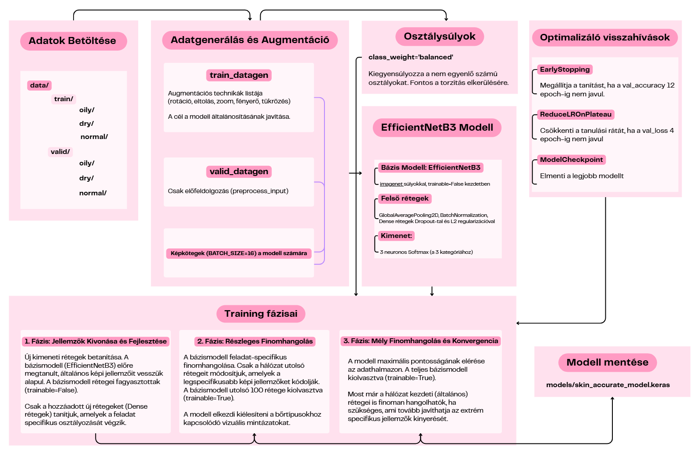
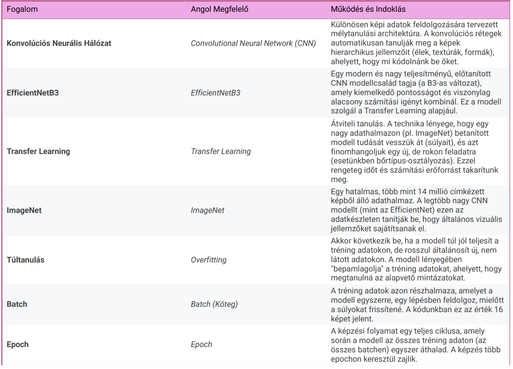
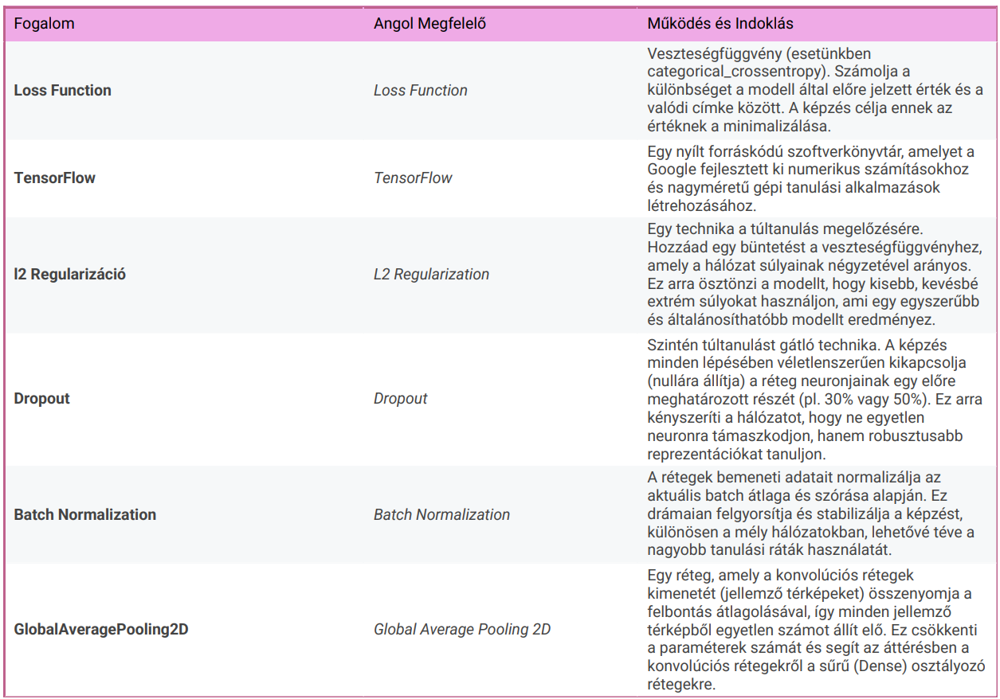

# A Bőrtípus-Osztályozó Konvolúciós Hálózat (EfficientNetB3) Működése

Ez a dokumentum részletesen bemutatja a **Transfer Learning** alapú képosztályozó modell teljes életciklusát, az adatok előkészítésétől a többlépcsős finomhangolási folyamatig. A fő cél a bőrtípusok (**normál, száraz, zsíros**) pontos azonosítása képek alapján.

## A Teljes Képzési Folyamat

A modell képzése progresszív finomhangolás mentén történik, kihasználva a TensorFlow és az EfficientNetB3 előnyeit.

1. **Adatok Előkészítése:** A tréning és validációs adatok beolvasása az adatgenerátorok segítségével történik. 
   A **tréning adatok** esetében augmentációt alkalmazunk (rotáció, zoom, eltolás stb.), hogy növeljük a modell robusztusságát és csökkentsük a túltanulás kockázatát.

2.  **Modell Inicializálása (EfficientNetB3):** A bázismodell az EfficientNetB3, amely már rendelkezik az      
   ImageNet adathalmazán megtanult, általános képi jellemzőkkel. 
   A modellre egy új, 3-osztályos kimenetet adunk.
   
3.  **Többlépcsős Képzés:** A képzés három fázisra bomlik, minden fázisban csökkenő tanulási rátával, és fokozatosan
   több réteget "olvasztunk ki" (teszünk taníthatóvá) a bázismodellből. Ezzel biztosítjuk, hogy az értékes, ImageNet-ről örökölt súlyok ne sérüljenek az új, kisebb adathalmazon történő hirtelen, nagy lépésekkel való módosításkor.
   
4.  **Optimalizáció és Védelem:** A képzés stabilitásáért az L2 regularizáció, a Dropout és a Batch Normalization
    rétegek felelnek, amelyek minimalizálják a túltanulást. Az automatikus képzésvezérléshez olyan visszahívásokat használunk, mint az EarlyStopping és a ReduceLROnPlateau, amelyek leállítják a felesleges képzést és optimalizálják a tanulási rátát.
   
5.  **Végső Kimenet (Output):** A modell elmenti a legjobb teljesítményt nyújtó súlyokat (`val_accuracy`) alapján
    egyetlen `.keras` fájlba.

---

## Funkciók:

A konvolúciós neurális hálózat (CNN) képzése összetett folyamat, amely több, egymásra épülő lépésből áll. A modell sikerességét a bemeneti adatok minősége, a hálózat architektúrája és az alkalmazott optimalizálási technikák összhangja határozza meg. 

---

### 1. Adatok Előkészítése és Augmentáció

A modell nem nyers adatokkal, hanem előkészített bemenetekkel dolgozik. 
Ennek célja: garantálni a modell számára a megfelelő felbontást és formátumot, valamint mesterségesen diverzifikálni a rendelkezésre álló adathalmazt.

#### 1.1. Adatforrások és Címkézés

A rendszer kizárólag a **'oily' (zsíros), 'dry' (száraz) és 'normal' (normál)** kategóriákra fókuszál. 
A Keras keretrendszer az adatok elérési útjából (`data/train` és `data/valid`) automatikusan elvégzi a címkézést (labeling): a képeket egyszerűen az alapján rendeli hozzá a megfelelő osztályhoz, hogy melyik alkönyvtárban találhatók.

#### 1.2. Az ImageDataGenerator és az Augmentáció

Mivel a gépi tanulásban a minőségi adatok kulcsfontosságúak, a modell általánosítási képességének fokozása érdekében augmentációt alkalmazunk. 
A **train_datagen** a meglévő képekből véletlenszerű transzformációk (pl. forgatás (90 fokig), szélesség- és magasságeltolás, zoomolás, fényerő-változtatás, valamint horizontális és vertikális tükrözés) révén gyakorlatilag végtelen számú új tréningmintát hoz létre.  
Ez a technika a túltanulás megelőzéséhez kell. 
A validációs adatok esetében viszont csak az előfeldolgozást (`preprocess_input`) alkalmazzuk, mert a modell teljesítményét valós, nem manipulált adatokon kell mérni.

#### 1.3. Kötegelés

A képzési folyamat nem egyetlen képet dolgoz fel egyszerre, hanem 16 képből álló kötegeket (`BATCH_SIZE=16`)**. 

---

### 2. Osztálysúlyok Számítása: A Kiegyensúlyozott Képzés

A valós adathalmazok szinte soha nem tökéletesen kiegyensúlyozottak. Például a 'normál' bőrtípusból több kép állhat rendelkezésre, mint a 'száraz' vagy 'zsíros' kategóriából. Ezt nevezzük **osztály-kiegyensúlyozatlanságnak**.

#### A Súlyozott Veszteségfüggvény

Ennek kezelésére a **class_weight='balanced'** paramétert használjuk. Ez a mechanizmus a ritkább osztályokhoz automatikusan nagyobb súlyt rendel. Amikor a modell hibázik egy ritka osztályú mintán, a veszteségfüggvény (**loss function**) nagyobb büntetést ad, mint amikor a gyakoribb osztályban hibázik. Ez arra kényszeríti a modellt, hogy jobban odafigyeljen a gyengén reprezentált osztályokra, elkerülve ezzel az adatok torzító hatását.

---

### 3. Modell Architektúra és Regularizáció

A modell az **EfficientNetB3** bázishálózaton alapul, amelyre egy egyedi osztályozó modult építünk.

#### 3.1. A Bázismodell és a Transfer Learning

Az **EfficientNetB3** egy rendkívül hatékony konvolúciós hálózat. Az átviteli tanulás (Transfer Learning) elve alapján a modellt ImageNet súlyokkal töltjük be. Ezek a súlyok már általános tudást tartalmaznak a vonalakról, élekről és textúrákról. Kezdetben a bázismodellt fagyasztjuk (**trainable=False**), hogy megőrizzük ezt az értékes, előtanult tudást.

#### 3.2. Osztályozó Fej

A bázismodell kimenetére új, sűrű (Dense) rétegeket adunk, amelyek elvégzik a specifikus bőrtípus-osztályozást:

* **GlobalAveragePooling2D:** Ez a réteg a sokdimenziós jellemző térképet egyetlen vektorrá redukálja, ami jelentősen   csökkenti a számítási terhet és a paraméterek számát.
  
* **BatchNormalization:** Minden réteg után normalizálja az aktivációkat. Ez stabilizálja a képzést és lehetővé teszi a nagyobb tanulási ráták használatát anélkül, hogy a hálózat divergálna.
  
* **Regularizáció (Dropout és L2):**
    * **Dropout:** A képzés során véletlenszerűen kikapcsolja a neuronok egy részét (0.3 és 0.5 arányban). Ez arra kényszeríti a hálózatot, hogy ne egy-egy neuronra támaszkodjon, ezáltal növelve a robusztusságot és megelőzve a túltanulást.
  
    * **L2 Regularization:** Ez a technika bünteti a túl nagy súlyokat a hálózatban. Az L2 norma $(0.001)$ hozzáadása a veszteségfüggvényhez segít megtartani a súlyokat alacsonyan, ami egy egyszerűbb és jobban általánosítható modellt eredményez. 
 
* **Kimenet:** Az utolsó réteg 3 neuronnal és `softmax` aktivációval rendelkezik, amely az egyes kategóriákhoz tartozó valószínűségi eloszlást adja.

---

### 4. Visszahívások: Automatikus Képzésvezérlés

A visszahívások (Callbacks) olyan automatizált mechanizmusok, amelyek a képzés alatt figyelik a modell teljesítményét, és beavatkoznak, ha a feltételek megkívánják.

* `EarlyStopping`: A legfontosabb védelmi vonal a túltanulás ellen. Ha a validációs pontosság (`val_accuracy`) 12
  epochon keresztül nem mutat javulást, a képzés leáll. 
  A `restore_best_weights=True` beállítás biztosítja, hogy a leállításkor a modell a legjobb, valaha elért súlyokkal folytassa.

* `ReduceLROnPlateau`: Ha a validációs veszteség (`val_loss`) 4 epochon keresztül nem csökken, a tanulási ráta felére
  csökken. Ezzel a stratégiai lépéssel a modell el tud mozdulni a lokális minimumokról, és finomabban keresheti a globális optimumot.
  
* `ModelCheckpoint`: Ez a funkció folyamatosan figyeli a `val_accuracy` alakulását. Csak akkor menti el a modellt a
  lemezre, ha egy adott epochban a pontosság meghaladja az eddigi legjobb értéket. Ezzel garantáltan csak a legjobb modellváltozat kerül elmentésre.

---

### 5. Képzés Fázisai: Progresszív Finomhangolás:

**Fázis 1**: Jellemzők Kivonása,Fagyasztott Bázismodell. 
Csak az új osztályozó rétegeket képezzük be. A magasabb tanulási ráta (10−3) gyorsan beállítja a kimeneti rétegeket az új feladathoz.

**Fázis 2**: Részleges Finomhangolás,"A bázismodell utolsó 100 rétegét kiolvasztjuk. Ezzel megengedjük a modellnek, hogy a kimenethez közelebbi, specifikus jellemzőket kinyerő rétegeket finoman adaptálja. A tanulási ráta tizedére csökken 10-4, hogy elkerüljük az előtanult tudás hirtelen felülírását."

**Fázis 3**: Mély Finomhangolás,"A teljes bázismodell kiolvasztva. Minden súly tanítható. A tanulási ráta még egyszer tizedére csökken 10 -5, ami rendkívül lassú, finom konvergenciát tesz lehetővé, ami kritikus a legmagasabb validációs pontosság eléréséhez.

---

## Szótár:

---

