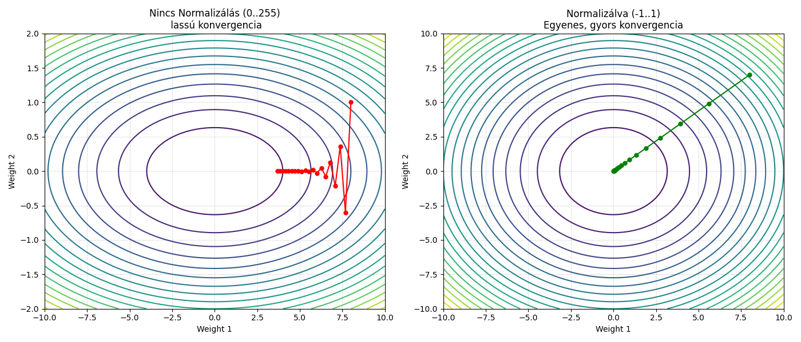

## 1.1. Input Normalizáció (Preprocessing)

A neurális hálózatok bemeneti rétege nem nyers, 0-255 közötti pixelértékeket vár, hanem matematikailag normalizált adatokat. A kódban ezt az `ImageDataGenerator` `preprocessing_function=preprocess_input` paramétere végzi el valós időben.

**A transzformáció logikája:**
Az EfficientNet modell specifikációja szerint a bemeneti képeket a **[-1, 1]** lebegőpontos tartományba kell skálázni. A függvény minden pixel minden csatornáján (RGB) a következő műveletet hajtja végre:

$$
Pixel_{new} = \frac{Pixel_{original}}{127.5} - 1.0
$$

**Példák az értékek átalakulására:**
* **Fehér:** Eredeti `(255, 255, 255)` $\rightarrow$ Modellnek `(1.0, 1.0, 1.0)`
* **Fekete:** Eredeti `(0, 0, 0)` $\rightarrow$ Modellnek `(-1.0, -1.0, -1.0)`
* **Szürke:** Eredeti `(127.5, 127.5, 127.5)` $\rightarrow$ Modellnek `(0.0, 0.0, 0.0)`
* **Piros:** Eredeti `(255, 0, 0)` $\rightarrow$ Modellnek `(1.0, -1.0, -1.0)` 

**Miért fontos ez?**
1.  **Transfer Learning Kompatibilitás:** Az alapmodell előtanított súlyai ("imagenet") ezen a skálázáson lettek optimalizálva.
2.  **Optimalizációs Stabilitás (Zero-Centered Data):** A [-1, 1] tartomány biztosítja a szimmetriát (0 körüli átlag), ami gyorsabb konvergenciát és stabilabb tanítást tesz lehetővé az `Adam` optimalizáló számára.



## 1.2. Adat Augmentáció (Data Augmentation)

Mivel a specifikus (jó minőségű, címkézett) bőrtípus-adatbázisok mérete korlátozott, a tanítás során valós idejű adatbővítést alkalmaztunk. Ez minden egyes epoch-ban a képek véletlenszerűen módosított variációit mutatja a modellnek, megelőzve a túltanulást.

Alkalmazott transzformációk a `train_datagen`-ben:
* **Rotation (90°):** A felhasználó bárhogyan tarthatja a kamerát.
* **Zoom (0.3):** A felhasználó lehet közelebb vagy távolabb a kamerától.
* **Brightness (0.7 - 1.3):** A fényviszonyok (nappali fény, lámpa, árnyék) szimulálása.
* **Horizontal/Vertical Flip:** A bőrtípus jellemzői nem irányfüggőek.
* **Fill Mode ('reflect'):** A geometriai transzformációk (pl. forgatás) során keletkező üres tereket nem feketével töltjük ki (ami hamis éleket hozna létre), hanem a kép szélének tükrözésével, így elkerülhető a mesterséges artifaktok tanulása.

## 1.3. Adatfolyam Generálása (`flow_from_directory`)

Ez a függvény végzi a képek tényleges összekapcsolását a fájlrendszerrel, az ún. **"Lusta Betöltést" (Lazy Loading)** alkalmazva.

A pipeline kulcsfontosságú lépései:
1.  **On-the-fly Átméretezés (`target_size=(300,300)`):** A rendszer a lemezről beolvasott, eltérő felbontású képeket azonnal a modell által elvárt 300x300-as méretre skálázza.
2.  **Batch Méret (`batch_size=16`):** A tanítás 16-os kötegekben történik. A 300x300-as felbontás és az EfficientNet mérete miatt a nagyobb batch (pl. 32 vagy 64) túlterhelné a GPU memóriáját (VRAM OOM).
3.  **Kategória Kódolás (`class_mode='categorical'`):** A mappák neveit (oily, dry, normal) a rendszer automatikusan **One-Hot Encoded** vektorokká alakítja (pl. Zsíros $\rightarrow$ `[1, 0, 0]`), mivel a modell Softmax kimenete is ezt a formátumot használja.
4.  **Keverés (`shuffle`):**
    * *Train:* `True` – Véletlenszerű sorrend a gradiens stabilizálásához.
    * *Valid:* `False` – Fix sorrend a kiértékelés (Confusion Matrix) pontossága érdekében.

---

# 2. Osztályok Kiegyensúlyozása (Class Weights)

Az adatok betöltése után, de még a modellépítés előtt számítjuk ki az osztálysúlyokat a `sklearn.utils.class_weight` segítségével.

**Probléma:** Az adathalmaz kiegyensúlyozatlansága (Class Imbalance). Ha a "Zsíros" bőrből sokkal több van, mint a "Szárazból", a modell hajlamos lenne a többségi osztályra optimalizálni (bias).

**Megoldás:** Kiszámoljuk az osztályok fordított gyakoriságát az alábbi képlettel:

$$
w_j = \frac{N}{k \cdot n_j}
$$

*(Ahol $N$ az összes kép, $k$ az osztályok száma, $n_j$ az adott osztály darabszáma.)*

**Implementáció:** A kiszámított súlyokat átadjuk a `model.fit` metódusnak. Ez közvetlenül módosítja a Veszteségfüggvényt (Loss Function - Categorical Crossentropy): a ritka osztályok tévesztése **nagyobb büntetést (penalty)** von maga után, kényszerítve a modellt, hogy minden típust egyformán jól tanuljon meg.

---

# 3. Modell Építése: Az Alapmodell (Backbone)

A kód következő része a neurális hálózat gerincének inicializálása.

## 3.1. EfficientNetB3 Betöltése

A fejlesztés során a Google által publikált **EfficientNetB3** architektúrát választottuk alapmodellnek.

**Miért EfficientNetB3?**
A korábbi architektúrákkal (pl. ResNet, VGG) ellentétben az EfficientNet az ún. **Compound Scaling** módszert alkalmazza. Nem csak a hálózat mélységét (rétegek száma) vagy szélességét (csatornák száma) növeli, hanem a bemeneti felbontást is optimalizálja.

* **Bemeneti méret:** 300x300 pixel. Ez elegendő részletességet biztosít a bőr pórusainak és textúrájának vizsgálatához, anélkül, hogy a VRAM igényt indokolatlanul megnövelné.
* **Hatékonyság:** Az EfficientNetB3 jobb pontosságot ér el az ImageNet adatbázison kevesebb paraméterrel, mint a jóval nagyobb ResNet-50 vagy InceptionV3, ami gyorsabb tanítást és inferenciát tesz lehetővé.

A kód paraméterei:
* **`weights="imagenet"`:** Betöltjük az ImageNet adatbázison (1.2 millió kép) előtanított súlyokat. A modell így már "lát": felismeri az éleket, textúrákat és formákat.
* **`include_top=False`:** Eltávolítjuk az eredeti (1000 osztályos) kimeneti réteget, hogy helyet készítsünk a saját bőrgyógyászati osztályozónknak.
* **`trainable = False` (Fagyasztás):** "Lefagyasztjuk" az alapmodell súlyait. Ez megvédi az előtanított tudást attól, hogy a tanítás elején (amikor a saját osztályozónk még pontatlan) a nagy hibagradiensek "szétrombolják" a finomhangolt szűrőket.

---

# 4. Modell Építése: Az Egyedi Osztályozó Fej (Custom Head)

Az alapmodellre (`base_model`) rétegről rétegre ráépítjük a saját döntéshozó egységünket (`model = Sequential...`). 

Az EfficientNetB3 "fej nélküli" változata a 300x300-as bemeneti képből egy **(9, 9, 1536)** méretű tenzort (3 dimenziós tömböt) állít elő kimenetként.

* **9x9 (Térbeli dimenzió):** Ez a tömörített térbeli információ. A modell a képet egy 9x9-es rácsra osztotta, így még pontosan tudja, mi hol vans (topológia megőrzése).
* **1536 (Mélység/Csatornák):** Ennyi különböző szűrő (filter) eredménye. Az egyik csatorna például a pirosságot, a másik a pórusok textúráját, a harmadik a csillogást detektálja.


1.  **GlobalAveragePooling2D:**
    * *Művelet:* Ez a réteg veszi a (9, 9, 1536) tenzort, és a 9x9-es térbeli dimenziókat **átlagolja**. A kimenet egy mindössze **1536** elemű vektor.
    * *Indoklás:*
        1.  **Dimenziócsökkentés:** 124,416 helyett csak 1536 bemenet (98%-os csökkenés), ami rendkívül hatékony.
        2.  **Térbeli invariancia:** A modell nem azt tanulja meg, hogy *hol* van a hiba (bal/jobb oldal), hanem hogy *létezik-e* a képen. A diagnózis szempontjából lényegtelen a pattanás (x, y) koordinátája.

2.  **BatchNormalization (Skálázási Stabilitás):**
    * *Művelet:* Normalizálja a rétegek közötti adatátvitelt 
    * *Indoklás:* Kezeli az ún. **Internal Covariate Shift** jelenséget. Megakadályozza, hogy a nagy értékű jellemzők elnyomják a kisebbeket, stabilizálja a gradienseket, és lehetővé teszi a gyorsabb konvergenciát a tanítás során.

3.  **Dense Rétegek + L2 Regularizáció (Hierarchikus Feldolgozás):**
    * *Művelet:* Kétlépcsős sűrű réteg (512 -> 256 neuron) ReLU aktivációval.
    * *Indoklás:* A rétegek hierarchikusan dolgozzák fel az információt: az első réteg a textúrák kombinációit, a második már absztraktabb fogalmakat alkot. Az **L2 Regularizáció** bünteti a túl nagy súlyokat, így kényszeríti a modellt, hogy "egyszerűbb", általánosíthatóbb összefüggéseket keressen a "bemagolás" helyett.

4.  **Dropout (Robusztusság növelése):**
    * *Művelet:* A tanulás során véletlenszerűen kikapcsolja a neuronok egy részét (50% és 30%).
    * *Indoklás:* Megakadályozza a neuronok "összedolgozását" (co-adaptation). A hálózatnak redundáns útvonalakat kell kiépítenie a döntéshozatalhoz, így a modell akkor is képes felismerni a bőrtípust, ha a kép egy része zajos vagy takart.

5.  **Softmax Kimenet (Döntés):**
    * *Művelet:* A hálózat nyers kimeneti értékeit valószínűségekké konvertálja.
    * *Eredmény:* Egy 3 elemű vektor (pl. `[0.1, 0.8, 0.1]`), amelynek összege mindig 1 (100%).
  


---

# 5. Tanítási Konfiguráció és Vezérlés

A modell architektúrájának összeállítása után definiáljuk a tanítási folyamat szabályait. Nem "vakon" futtatjuk a tanítást, hanem automatizált felügyelő rendszereket (Callbacks) és dinamikus tanulási rátát alkalmazunk.

## 5.1. Automatizált Felügyelet (Callbacks)

A `callbacks_list` egy olyan funkciócsomag, amely minden epoch végén lefut, és beavatkozik, ha szükséges.

1.  **EarlyStopping (`monitor='val_accuracy'`, `patience=12`):**
    * *Funkció:* Figyeli a validációs pontosságot. Ha 12 epochon keresztül nem javul az eredmény, automatikusan leállítja a tanítást.
    * *Indoklás:* Megakadályozza az erőforrás-pazarlást és a **túltanulást**. A `restore_best_weights=True` garantálja, hogy a leállításkor a rendszer visszaáll a valaha volt **legjobb** állapotra, nem pedig az utolsó (esetleg már romló) állapotot menti meg.

2.  **ReduceLROnPlateau (`monitor='val_loss'`, `factor=0.5`):**
    * *Funkció:* Ha a validációs hiba (`val_loss`) 4 epochon át stagnál ("platóra ér"), a rendszer a felére csökkenti a tanulási rátát.
    * *Indoklás:* A tanítás elején nagy lépésekkel haladunk. Amikor a modell eléri a képességei határát és "elakad", a lépésköz finomítása (lassítás) segíthet megtalálni a globális minimumot.

3.  **ModelCheckpoint (`save_best_only=True`):**
    * *Funkció:* Minden javulásnál elmenti a modell súlyait (`skin_accurate_model.keras`).
    * *Indoklás:* Biztonsági mentés. Ha a rendszer leállna, vagy a tanítás végére a modell teljesítménye leromlana, a lemezen mindig a matematikailag legjobb verzió marad meg.


## 5.2. A Modell Fordítása (Compile)

Itt rendeljük hozzá a matematikai algoritmusokat a neurális hálóhoz:
* **Optimizer (Adam, `lr=0.001`):** A `0.001` egy viszonylag magas kezdőérték, ami az első fázisban (amikor a modell feje még "üres") a gyors konvergenciát segíti.
* **Loss Function (Categorical Crossentropy):** Mivel 3 osztályunk van és One-Hot kódolást használunk, ez a függvény optimalizálja a valószínűségi eloszlást.

## 5.3. A Tanítás Indítása: I. Fázis (Feature Extraction)

```python
model.fit(train_data, epochs=10, class_weight=class_weights_dict, ...)

```

Ez a progresszív tanítási stratégia első lépése.

* **Állapot:** Az EfficientNet alapmodell **fagyasztva van**. Csak a hozzáadott "Fej" (saját Dense rétegek) tanul.
* **`epochs=10`:** Rövid futás, mivel csak a véletlenszerűen inicializált fej "szinkronizálása" a cél az alapmodellel.
* **`class_weight`:** Itt adjuk át a súlyozási szótárat. Ez biztosítja, hogy a ritka bőrtípusok (pl. Száraz) hibáit a modell már az első perctől kezdve kiemelten kezelje (büntesse), elkerülve a torzítást.

## 5.4. II. Fázis: Részleges Finomhangolás (Partial Fine-Tuning)

Az első fázis után a modellünk már rendelkezik egy betanított osztályozó "fejjel", de az alapmodell (EfficientNet) még mindig az eredeti, ImageNet-re (kutyákra, tárgyakra) optimalizált súlyokat használja. A maximális pontosság eléréséhez a hálózatot specifikussá kell tennünk a bőrgyógyászati feladatra.

A kódban ezt egy **szelektív feloldással** érjük el:

```python
base_model.trainable = True             # 1. Minden réteg feloldása
for layer in base_model.layers[:-100]:  # 2. Az alsó rétegek visszazárása
    layer.trainable = False             #    (kivéve az utolsó 100-at)

```

**Mérnöki Indoklás (Hierarchikus Tanulás):**
A Konvolúciós Hálózatok (CNN) rétegei hierarchikusan épülnek fel:

1. **Alsó rétegek (Inputhoz közel):** Univerzális vizuális elemeket detektálnak (élek, színek, egyszerű textúrák). Mivel a bőrnek is vannak élei és textúrája, ezt a tudást **megőrizzük (fagyasztva hagyjuk)**. Ha ezt is tanítanánk, feleslegesen növelnénk a számítási igényt és a túltanulás kockázatát.
2. **Felső rétegek (Kimenethez közel - az utolsó 100):** Komplex, absztrakt objektumokat ismernek fel (pl. eredetileg "szemeket" vagy "kerekeket"). Ezeket **taníthatóvá tesszük**, hogy a modell a "kerék" mintázat helyett a "pattanás" vagy "zsíros csillogás" mintázatára specializálódjon.

**Tanulási Ráta (`lr=0.0001`):**
A sebességet az előző fázis tizedére csökkentjük. Mivel a felolvasztott rétegek már rendelkeznek jó (előtanított) súlyokkal, a gyors tanulás "szétrombolná" ezt a tudást. A finomhangolás célja az adaptáció, nem az újratanulás.

## 5.5. III. Fázis: Teljes Finomhangolás (Full Fine-Tuning)

Ez a modellképzés végső, legérzékenyebb szakasza ("Polírozás").

```python
base_model.trainable = True  # A teljes hálózat tanulhat
model.compile(optimizer=optimizers.Adam(learning_rate=0.00001), ...)

```

**Működés:**
Eltávolítjuk az összes korlátozást: a hálózat legelső rétegétől a legutolsóig minden paraméter módosulhat.

**Indoklás:**
Bár az alsó rétegek (vonalak, élek) univerzálisak, a II. fázis után előfordulhatnak apró "illesztési hibák" a fagyasztott alsó és a módosított felső rétegek között. A teljes megnyitás lehetővé teszi a hálózatnak, hogy globálisan harmonizálja a jeltovábbítást.

**Tanulási Ráta (`lr=0.00001`):**
A sebesség itt már mikroszkopikus (a kezdeti érték 1%-a). Ebben a fázisban a modell pontossága jellemzően már csak tizedszázalékokat javul, de ez a stabilitás és a végső megbízhatóság szempontjából kritikus.

## 5.6. Végső Kimenet és Naplózás

A folyamat lezárásaként elmentjük a tanítási eredményeket.

```python
history_final = model.fit(train_data, epochs=25, ...)
print("A modell elkészült.")

```

**A `history_final` szerepe:**
Ez az objektum tárolja a tanítási folyamat teljes diagnosztikai adatait (veszteség és pontosság minden epoch-ban). Ez szolgál alapul a tanítási görbék (Learning Curves) kirajzolásához és a modell teljesítményének vizuális kiértékeléséhez. A `ModelCheckpoint` pedig eközben automatikusan lemezre mentette a legjobban sikerült modellverziót.

---

# 6. Az Inferenciális Pipeline (`predict_app.py`)

A tanítási fázis lezárultával a `skin_accurate_model.keras` fájl tartalmazza a hálózat optimalizált súlyait. A `predict_app.py` script felelős az **inferenciáért** , vagyis a modell éles környezetben történő alkalmazásáért.


## 6.1. A Modell Memóriába Töltése

```python
model = load_model(MODEL_PATH, compile=False)

```

**Optimalizáció (`compile=False`):**
A `load_model` függvény alapértelmezetten megpróbálja visszaállítani a modell teljes állapotát, beleértve az optimalizálót (Adam), a veszteségfüggvényt és a metrikákat is.

* **Inferencia esetén** ezekre nincs szükség, mivel nem történik súlymódosítás (Backpropagation).
* A `compile=False` paraméterrel a betöltés jelentősen gyorsabb, és a memórialábnyom (RAM usage) alacsonyabb, mivel a TensorFlow nem építi fel a tanításhoz szükséges számítási gráfot (Computation Graph).

## 6.2. Bemeneti Adat Előfeldolgozása (Preprocessing Pipeline)

A neurális hálózatok determinisztikusak: a bemeneti adatnak matematikailag azonos szerkezetűnek kell lennie a tanítás során használt adatokkal.

### 6.2.1. Képbetöltés és Tenzor-konverzió

```python
img = image.load_img(image_path, target_size=(IMG_SIZE, IMG_SIZE))
img_array = image.img_to_array(img)

```

* **Skálázás:** A lemezről beolvasott képet a rendszer azonnal `300x300` pixelre méretezi (Bilinear interpolation), mivel az EfficientNetB3 bemeneti rétege fixen ezt a dimenziót várja.
* **Tenzor:** A képobjektumot NumPy tömbbé (`float32`) konvertáljuk.

### 6.2.2. Dimenzió-kiterjesztés (Batch Dimension)

```python
img_array = np.expand_dims(img_array, axis=0)

```

**A "Rank-4" Tenzor:**
A modell nem egyetlen képet vár `(Height, Width, Channels)` formátumban, hanem képek kötegét (Batch). Még ha egyetlen képet elemzünk is, szimulálnunk kell egy 1 elemű köteget.

* Eredeti dimenzió: `(300, 300, 3)`
* Kiterjesztett dimenzió: `(1, 300, 300, 3)`

Enélkül a dimenzióillesztés nélkül a modell `ValueError`-t dobna.

### 6.2.3. Numerikus Normalizáció

```python
img_array = preprocess_input(img_array)

```

Ez a lépés hajtja végre a **[-1, 1]** tartományra történő skálázást, az EfficientNet specifikációjának megfelelően. Ez biztosítja, hogy a pixelintenzitások eloszlása megegyezzen a modell által tanult súlyok érzékenységével.

## 6.3. Predikció és Valószínűségi Térkép

```python
predictions = model.predict(img_array, verbose=0)
score = predictions[0]

```

A hálózat kimenete (`predictions`) egy `(1, 3)` méretű tömb, amely a **Softmax** aktivációs függvény eredményét tartalmazza.

* Az értékek 0 és 1 között vannak.
* Az értékek összege pontosan 1 (100%).
* A `score` változó tartalmazza az egyes osztályokhoz (oily, dry, normal) tartozó valószínűségeket.

## 6.4. Heurisztikus Utófeldolgozás (Post-Processing Logic)

Mivel a neurális hálózatot 3 diszkrét osztályra tanítottuk, de az üzleti logika 4 osztályt (Kombinált bőr) igényel, egy **szabályalapú réteget (Rule-based Layer)** illesztettünk a modell kimenetére.

```python
# Hibrid osztályozási logika
if results['oily'] > 35 and results['dry'] > 20:
    winner = "combination"

```

**Szakmai indoklás:**
A kombinált bőr biológiai jellemzője a heterogenitás (zsíros T-zóna, száraz orcák). A neurális hálózat ezt "bizonytalanságként" éli meg: egyszerre detektál zsíros (`oily`) és száraz (`dry`) jellemzőket (textúrákat) a képen.
A kód ezt a bizonytalanságot használja fel: ha a modell egyik osztály mellett sem köteleződik el dominánsan, de mind a zsíros, mind a száraz jegyek szignifikánsan jelen vannak (küszöbérték felett), az algoritmus felülbírálja a `winner` osztályt "combination"-re.

## 6.5. Kimeneti Interfész (Standard Output)

```python
output = {
    "skinType": winner,
    "confidence": confidence,
    "details": results
}
print(json.dumps(output))

```

A Python script "Microservice"-ként viselkedik. Az eredményt nem a képernyőre írja emberi olvasásra, hanem szabványos **JSON formátumban** a `stdout`-ra (Standard Output).
Ez lehetővé teszi a hívó fél (pl. Node.js backend) számára, hogy:

1. Futtassa a scriptet.
2. Elkapja a kimeneti streamet.
3. `JSON.parse()` segítségével közvetlenül felhasználja az adatokat az alkalmazásban.