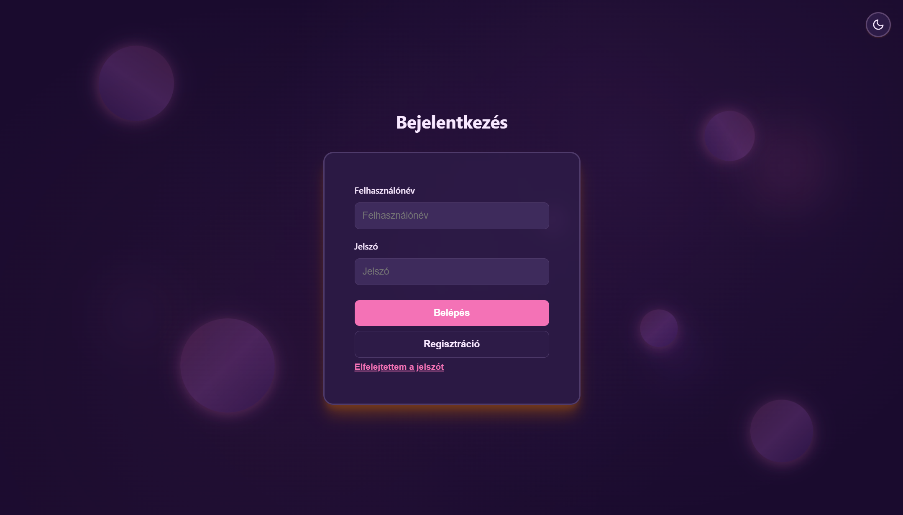

# Season Analysis App

## Important Notice
Password recovery will **NOT WORK** on Railway because outbound SMTP is blocked. I could pay for a different pack... but I won't cause I'm poor. I could also switch to an email API, but I don't have any time (sry). If you want to use password reset, you must run the backend locally or switch to an email API service (e.g. SendGrid, Resend, Mailgun). Sorry for the inconvenience—next time I will use an email API, or I'll fix it in the future.

## What does this app do?
Season Analysis App is a full-stack web application for personal color analysis and recommendation. The app helps users discover their color season (Spring, Summer, Autumn, Winter) using AI-powered chat and analysis. Users can interact with an AI assistant, receive personalized color advice, and save their favorite colors to their profile. The app is designed for anyone interested in color theory, personal styling, or simply exploring which colors suit them best.

### Main features
- **AI-powered color analysis:** Users can chat with an AI (Google Gemini) to analyze their color type based on answers to style and appearance questions. The AI suggests a color season and provides tailored advice.
- **User registration and authentication:** Secure registration and login with JWT tokens. User data is stored in a MySQL database.
- **Profile management:** Users can view and edit their profile, including their name, email, and assigned color season. The color season is displayed with a localized name and can be updated after new analysis.
- **Favorite colors:** Users can save multiple favorite colors (1:N relationship) to their profile. Colors are stored as hex codes and can be added or removed at any time.
- **Light and dark mode:** The app includes a theme switcher that allows users to toggle between light and dark mode for comfortable viewing in any environment.
- **Password reset:** Users can request a password reset link via email (only works locally due to Railway SMTP restrictions).
- **Email notifications:** The app sends email notifications for password recovery and account changes (only works locally).
- **Modern frontend:** The UI is built with Vue 3 and Vite, featuring a responsive design, animated backgrounds, and a clean component structure.
- **RESTful backend:** The backend is built with Node.js, Express, and Sequelize ORM, providing a robust API for all user and color operations.
- **Database:** All user, color, and season data is stored in a MySQL database, which can be hosted locally or on Railway.
- **Security:** Passwords are hashed with bcrypt, and all sensitive operations require JWT authentication.

### Technologies used
- **Frontend:** Vue 3, Vite, SCSS
- **Backend:** Node.js, Express, Sequelize
- **Database:** MySQL (local or Railway)
- **AI:** Google Gemini API
- **Authentication:** JWT
- **Email:** Nodemailer (SMTP, only works locally)

### User journey
1. **Registration:** Users sign up with their email, password, and name. Passwords are securely hashed.
2. **Login:** Users log in and receive a JWT token for authenticated requests.
3. **Profile:** Users can view their profile, see their color season, and manage favorite colors.
4. **AI chat:** Users interact with the AI to analyze their color type. The AI asks questions and recommends a color season.
5. **Save results:** The recommended color season is saved to the user's profile. Users can manually add favorite colors suggested by the AI.
6. **Password recovery:** If a user forgets their password, they can request a reset link (only works locally).

### Limitations
- Password reset and email notifications only work locally due to Railway SMTP restrictions.
- For production email, use an email API (SendGrid, Resend, Mailgun).
- AI color analysis requires a valid Google Gemini API key.

### Example use cases
- Personal styling: Find out which colors suit you best for clothing, makeup, or accessories.
- Color theory exploration: Learn about color seasons and how they relate to your appearance.
- Save and organize favorite colors for future reference.
- Use AI to get instant, personalized advice on color choices.

If you run the backend locally, all features will work, including password recovery. For production, switch to an email API for notifications and password reset.

## Screenshots

### Authentication
The app features a modern login interface with light and dark mode support:

### Profile Management
Users can view their color season, profile information, and manage their favorite colors:

### AI Color Analysis
The AI assistant guides users through a color analysis conversation, asking questions about their appearance and style preferences:

### Analysis Results
After the conversation, users receive their personalized color season recommendation with detailed explanations:

