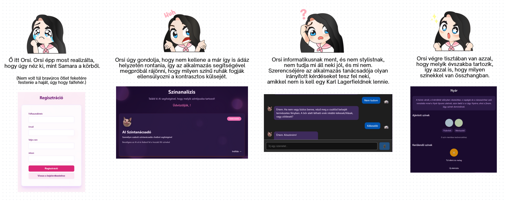
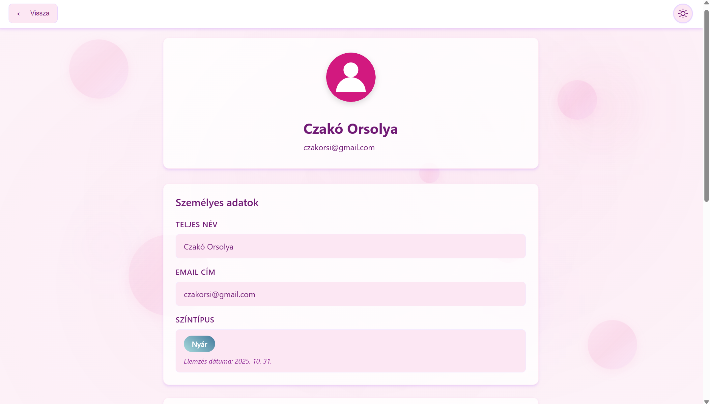

# Season Analysis App

## Important Notice
Password recovery will **NOT WORK** on Railway because outbound SMTP is blocked. I could pay for a different pack... but I won't cause I'm poor. I could also switch to an email API, but I don't have any time (sry). If you want to use password reset, you must run the backend locally or switch to an email API service (e.g. SendGrid, Resend, Mailgun). Sorry for the inconvenience—next time I will use an email API, or I'll fix it in the future.

## What does this app do?
Season Analysis App is a full-stack web application for personal color analysis and recommendation. The app helps users discover their color season (Spring, Summer, Autumn, Winter) using AI-powered chat and analysis. Users can interact with an AI assistant, receive personalized color advice, and save their favorite colors to their profile. The app is designed for anyone interested in color theory, personal styling, or simply exploring which colors suit them best.

### Main features
- **AI-powered color analysis:** Users can chat with an AI (Google Gemini) to analyze their color type based on answers to style and appearance questions. The AI suggests a color season and provides tailored advice.
- **Guest mode:** Visitors can try the AI color analysis without registration. Guest users can chat with the AI and receive color recommendations, but results are not saved to their profile.
- **User registration and authentication:** Secure registration and login with JWT tokens. User data is stored in a MySQL database.
- **Profile management:** Users can view and edit their profile, including their name, email, and assigned color season. The color season is displayed with a localized name and can be updated after new analysis.
- **Favorite colors:** Users can save multiple favorite colors (1:N relationship) to their profile. Colors are stored as hex codes and can be added or removed at any time.
- **Light and dark mode:** The app includes a theme switcher that allows users to toggle between light and dark mode for comfortable viewing in any environment.
- **Password reset:** Users can request a password reset link via email (only works locally due to Railway SMTP restrictions).
- **Email notifications:** The app sends email notifications for password recovery and account changes (only works locally).
- **Modern frontend:** The UI is built with Vue 3 and Vite, featuring a responsive design, animated backgrounds, and a clean component structure.
- **RESTful backend:** The backend is built with Node.js, Express, and Sequelize ORM, providing a robust API for all user and color operations.
- **Database:** All user, color, and season data is stored in a MySQL database, which can be hosted locally or on Railway.
- **Security:** Passwords are hashed with bcrypt, and all sensitive operations require JWT authentication.

### Technologies used
- **Frontend:** Vue 3, Vite, SCSS
- **Backend:** Node.js, Express, Sequelize
- **Database:** MySQL (local or Railway)
- **AI:** Google Gemini API
- **Authentication:** JWT
- **Email:** Nodemailer (SMTP, only works locally)

### User journey
1. **Guest mode (optional):** Visitors can try the AI color analysis without registration by clicking "Kipróbálás vendégként" on the login page. Guest sessions provide full AI interaction but don't save results.
2. **Registration:** Users sign up with their email, password, and name. Passwords are securely hashed.
3. **Login:** Users log in and receive a JWT token for authenticated requests.
4. **Profile:** Users can view their profile, see their color season, and manage favorite colors.
5. **AI chat:** Users interact with the AI to analyze their color type. The AI asks questions and recommends a color season.
6. **Save results:** The recommended color season is saved to the user's profile (registered users only). Users can manually add favorite colors suggested by the AI.
7. **Password recovery:** If a user forgets their password, they can request a reset link (only works locally).

### Limitations
- Password reset and email notifications only work locally due to Railway SMTP restrictions.
- For production email, use an email API (SendGrid, Resend, Mailgun).
- AI color analysis requires a valid Google Gemini API key.

### Use Case 

---

### Benefits
- **Personalized guidance:** AI-driven color analysis tailored to individual features
- **Organized color management:** Save and reference favorite colors anytime
- **Educational:** Learn about color theory and seasonal color analysis
- **Practical application:** Use recommendations for shopping, makeup, and styling decisions
- **Convenient:** Access your color profile from any device

If you run the backend locally, all features will work, including password recovery.

## Screenshots

### Authentication
The app features a modern login interface with light and dark mode support:

### Profile Management
Users can view their color season, profile information, and manage their favorite colors:

### AI Color Analysis
The AI assistant guides users through a color analysis conversation, asking questions about their appearance and style preferences:

### Analysis Results
After the conversation, users receive their personalized color season recommendation with detailed explanations:

---

## Future Plans

The following features are planned for future development to enhance the Season Analysis App:

### Capsule Wardrobe Builder
Create a personalized capsule wardrobe based on your color season. This feature will help users build a minimal, versatile wardrobe where every piece complements their natural coloring and can be mixed and matched efficiently.

### Intelligent Clothing Recommendations
AI-powered clothing recommendations that suggest specific garments, styles, and combinations based on your color season, body type, and personal preferences. The system will learn from user feedback to provide increasingly personalized suggestions.

### Skin Tone Analysis
Advanced skin analysis feature that goes beyond color seasons to provide detailed insights about skin undertones, overtones, and characteristics. This will help users make better decisions about makeup, foundation shades, and skincare products.

### AI Model Refinement
Continuous improvement of the AI color analysis model. While the current system provides good results, ongoing refinement will enhance accuracy, reduce edge cases, and provide more nuanced seasonal classifications including sub-seasons (e.g., Light Summer, Deep Winter, Warm Autumn).

### Mobile Application
Native mobile app for iOS and Android using WebView technology. This approach is chosen for simplicity and efficiency, as it allows the existing web application to be wrapped in a mobile app without requiring separate native development. This way, all features remain synchronized across platforms without maintaining multiple codebases.

---

